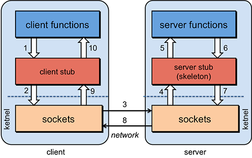

[TOC]

## 前言

[**gRPC**](https://github.com/grpc/grpc)是一款语言中立、平台中立、开源的远程过程调用(Remote Procedure Call，RPC)框架。在使用gRPC API前，我们有必要搞明白，**什么是RPC**。可以阅读这个连接：[谁能用通俗的语言解释一下什么是 RPC 框架？](https://www.zhihu.com/question/25536695)。下面简单描述下。

[RPC](https://zh.wikipedia.org/wiki/%E9%81%A0%E7%A8%8B%E9%81%8E%E7%A8%8B%E8%AA%BF%E7%94%A8)是一个计算机通信协议。该协议允许运行于一台计算机的程序调用另一个地址空间（通常为一个开放网络的一台计算机）的子程序，而程序员就像调用本地程序一样，无需额外地为这个交互作用编程（无需关注细节）。RPC是一种服务器-客户端（Client/Server）模式，经典实现是一个通过发送请求-接受回应进行信息交互的系统。

RPC中可能需要实现这几部分。

* 要解决通讯的问题。客户端和服务端需要建立连接，进行通讯。
* 调用问题。同一个进程空间内，可以通过指针调用函数。不同程序间的函数调用，需要一个映射。
* 序列化和反序列化(远程调用的参数和返回值)。进程内存中的数据，通过网络，从一个进程，发送给另一个进程。gRPC这部分使用的是protobuf。使用gRPC需要先了解protobuf，见：[protobuf在c++中的简单使用](https://blog.csdn.net/sinat_38816924/article/details/131380723)。

(图片来自上面链接,链接已404)


---

## grpc的安装

首先需要安装protobuf。

```shell
# windows上安装protobuf
vcpkg.exe install protobuf:x64-windows

# linux上安装protobuf
sudo apt install libprotobuf-dev protobuf-compiler
```

接着安装grpc。对于C++来说，文档建议用源码编译安装：[gRPC - now with easy installation](https://grpc.io/blog/installation/)。我向来是讨厌源码安装的。因为，源码安装的内容，不方便管理，如卸载/升级等。所以，本文使用包/库管理器安装。

```shell
# Windows
vcpkg.exe install pkgconf:x64-windows
vcpkg install grpc:x64-windows

# Linux
sudo apt -y install protobuf-compiler-grpc
sudo apt install libgrpc++-dev
```

---

## gRPC的简单使用

**本节完整代码见仓库**。

本节内容，来自：[Introduction to gRPC](https://grpc.io/docs/what-is-grpc/introduction/)、[grpc- Core concepts, architecture and lifecycle](https://grpc.io/docs/what-is-grpc/core-concepts/)、[grpc-c++ quick start](https://grpc.io/docs/languages/cpp/quickstart/)、[grpc-c++ Basics tutorial](https://grpc.io/docs/languages/cpp/basics/)、[gRPC C++ 入门教程](https://blog.csdn.net/lihao21/article/details/104138126)

程序员有时候很无聊，得看了很多API文档。本节是个简单的RPC示例：client使用stub发动一个请求后，等待服务端的回复。对于客户端而言，就像调用一个简单的函数。

---

### 生成client和server的接口代码

从`.proto`的`service`的定义中，使用`protoc`(protocol buffer compiler),指定 gRPC C++ plugin，来生成 client 和 server 的接口。

`calculator.proto`内容如下：

```proto
syntax = "proto3";

package math;

service calculator {
  rpc sum(request) returns (reply) {}
}

message request {
  int32 addend = 1;
  int32 additive_term = 2; 
} 

message reply {
  int32 result = 1;
}
```

[protocol buffers](https://protobuf.dev/getting-started/cpptutorial/)的内容不再介绍。其中，`service`中定义的`rpc`方法，指定了请求和响应的内容，`sum`将会被想函数一样进行调用。

可以通过`protoc`下面这样的命令，生成客户端和服务端的接口。

```shell
protoc -I .. --grpc_out=. --plugin=protoc-gen-grpc=`which grpc_cpp_plugin` --cpp_out=. calculator.proto
```

会生成`calculator.pb.h`,`calculator.pb.cc`的message类头文件和对应的实现, 是message的 protocol buffer的序列化，反序列化,相关操作的代码。`calculator.grpc.pb.h`,`calculator.grpc.pb.cc`,是可以被client远程调用server的接口,和server需要实现的接口。

上面的命令需要在CMakeLists.txt中执行。略微有点难写。

```cmake
cmake_minimum_required(VERSION 3.11)
project(hello_grpc)

set(Protobuf_USE_STATIC_LIBS ON)
# cmake-format: off
# ubuntu通过apt包管理器安装的grpc没有findgrpc.cmake这样的文件，但是有.pc这样的文件
# windows通过vcpkg库管理器安装的grpc有gRPCConfig.cmake,但是没有.pc文件
# 。。无语，大无语。。
# Linux上用PkgConfig获取库;windows上直接通过find_package查找;
# cmake-format: on
find_package(PkgConfig REQUIRED)
find_package(Protobuf REQUIRED)
if(WIN32)
  find_package(GRPC REQUIRED)
  get_target_property(GRPC_CPP_PLUGIN gRPC::grpc_cpp_plugin LOCATION)
  set(GRPC_LIBRARIES gRPC::grpc++) # 这样也可以,nb
else()
  find_program(GRPC_CPP_PLUGIN grpc_cpp_plugin REQUIRED)
  pkg_check_modules(GRPC REQUIRED grpc++)
endif()

# Proto file
set(calcu_proto "${CMAKE_SOURCE_DIR}/calculator.proto")
get_filename_component(calcu_proto_path "${calcu_proto}" PATH)

set(calcu_proto_srcs "${CMAKE_CURRENT_BINARY_DIR}/calculator.pb.cc")
set(calcu_proto_hdrs "${CMAKE_CURRENT_BINARY_DIR}/calculator.pb.h")
set(calcu_grpc_srcs "${CMAKE_CURRENT_BINARY_DIR}/calculator.grpc.pb.cc")
set(calcu_grpc_hdrs "${CMAKE_CURRENT_BINARY_DIR}/calculator.grpc.pb.h")

# 不要使用execute_process(),它在配置的时候调用
# 使用add_custom_command(),当有target使用OUTPUT中的输出时,将调用这个命令重新生成
add_custom_command(
  OUTPUT "${calcu_proto_srcs}" "${calcu_proto_hdrs}" "${calcu_grpc_srcs}"
         "${calcu_grpc_hdrs}"
  COMMAND
    ${Protobuf_PROTOC_EXECUTABLE} ARGS --grpc_out "${CMAKE_CURRENT_BINARY_DIR}"
    --cpp_out "${CMAKE_CURRENT_BINARY_DIR}" -I "${calcu_proto_path}"
    --plugin=protoc-gen-grpc="${GRPC_CPP_PLUGIN}" "${calcu_proto}"
  DEPENDS "${calcu_proto}")

# Include generated *.pb.h files
include_directories("${CMAKE_CURRENT_BINARY_DIR}")

add_library(calcu_grpc_proto ${calcu_proto_srcs} ${calcu_proto_hdrs}
                             ${calcu_grpc_srcs} ${calcu_grpc_hdrs})

target_link_libraries(calcu_grpc_proto ${GRPC_LIBRARIES} ${Protobuf_LIBRARIES})

foreach(_target main client server)
  add_executable(${_target} "${CMAKE_SOURCE_DIR}/${_target}.cpp")
  target_link_libraries(${_target} calcu_grpc_proto ${GRPC_LIBRARIES}
                        ${Protobuf_LIBRARIES})
endforeach()
```

---

### 创建服务端

服务端代码包含两部分：一部分是实现`.proto`中定义的接口。另一部分是运行gRPC的服务，已监听客户端发送过来的请求。

需要注意的是，服务端的方法可以被客户端的多个线程同时调用，需要线程安全。

首先是，实现`.proto`中定义的接口。

```cpp
class CalcuServiceImpl final : public math::calculator::Service {
  grpc::Status sum(grpc::ServerContext *context, const math::request *request,
                   math::reply *reply) override {
    reply->set_result(request->addend() + request->additive_term());
    return grpc::Status::OK;
  }
};
```

这个方法，需要被传入一个`context`，它被gRPC使用。比如，客户端在里面传入了截止日期。`request`和`reply`是protocol buffer。`request`是客户端传递过来的参数，`reply`是服务端回复给客户端的内容。

接下来，需要启动gRPC的服务，一遍客户端可以使用上面定义的服务。

```cpp
void RunServer() {
  // 在windows会报错,不知道是不是防火墙的原因,没去细察
  // std::string server_address("0.0.0.0:5000");
  std::string server_address("127.0.0.1:5000");
  CalcuServiceImpl service;

  grpc::ServerBuilder builder;
  // Listen on the given address without any authentication mechanism.
  builder.AddListeningPort(server_address, grpc::InsecureServerCredentials());
  // Register "service" as the instance through which we'll communicate with
  // clients. In this case it corresponds to an *synchronous* service.
  builder.RegisterService(&service);
  // Finally assemble the server.
  std::unique_ptr<grpc::Server> server(builder.BuildAndStart());
  std::cout << "Server listening on " << server_address << std::endl;

  // Wait for the server to shutdown. Note that some other thread must be
  // responsible for shutting down the server for this call to ever return.
  server->Wait();
}
```

我们使用 `ServerBuilder` 构建并启动服务器。

1. 创建我们的服务实现类 `CalcuServiceImpl` 的一个实例。
2. 创建工厂 `ServerBuilder` 类的实例。
3. 指定要用于使用生成器的 `AddListeningPort()` 方法侦听客户端请求的地址和端口。`InsecureServerCredentials`是指不安全的方式。其他参数,自行参考官方文档。
4. 在构建器上调用 `BuildAndStart()` ，为我们的服务创建并启动RPC服务器。
5. 在服务器上调用 `Wait()` 进行阻塞等待，直到进程被终止或调用 `Shutdown()` 。

---

### 创建客户端

首先我们需要为stub创建一个channel,指定我们想要连接的服务器地址和端口。然后使用从`.proto`生成的 `calculator` 类中提供的 `NewStub` 方法，创建一个stub(里面有我们可以调用的接口, channel提供了服务端的地址和端口)。

接着，我们创建并填充了一个protocol buffer的请求对象，创建了一个响应的protocol buffer对象。我们的还创建了 `ClientContext` 对象-你可以选择在此对象上设置RPC配置值，例如截止日期，但目前我们将使用默认设置。请注意，不能在调用之间重用此对象。最后，我们调用存根上的方法，将上下文、请求和响应传递给它。如果方法返回 `OK` ，那么我们可以从响应对象中读取服务器的响应信息。

```cpp
class calcuClient {
public:
  calcuClient(std::shared_ptr<grpc::Channel> channel)
      : stub_(math::calculator::NewStub(channel)) {}
  int sum(const int a, const int b) {
    math::request req;
    req.set_addend(a);
    req.set_additive_term(b);
    math::reply reply;
    grpc::ClientContext context;

    grpc::Status status = stub_->sum(&context, req, &reply);

    if (status.ok()) {
      return reply.result();
    } else {
      std::cout << status.error_code() << ": " << status.error_message()
                << std::endl;
      return -1;
    }
  }

private:
  std::unique_ptr<math::calculator::Stub> stub_;
};

int main(int argc, char **argv) {
  std::string server_address("127.0.0.1:5000");
  calcuClient calcu(
      grpc::CreateChannel(server_address, grpc::InsecureChannelCredentials()));
  int result = calcu.sum(1, 2);
  std::cout << "calcu received: " << result << std::endl;

  return 0;
}
```

---

### 最后

本文没有提到，流式RPC，异步API，安全传输等，详细见官方文档。

本文在提到API的时候，并没有给出API的链接，详细见官方文档。

本文的cmake构建方式，在win11和wsl2-ubuntu22上测试过，更多系统没有测试。
