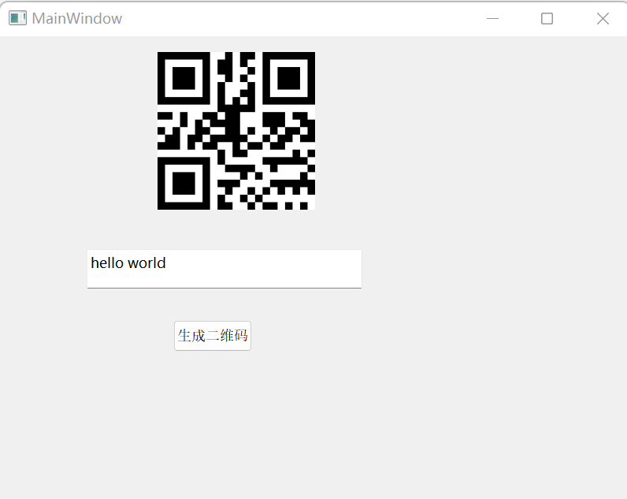

# C++中生成二维码

## 前言

[二维码](https://zh.wikipedia.org/zh-hans/%E4%BA%8C%E7%B6%AD%E7%A2%BC)的种类很多。本文仅介绍，如何用C++生成[QR码(QRcode)](https://zh.wikipedia.org/zh-hans/QR%E7%A2%BC)。通常而言，我们不需要知道QR码的详细结构，如[QrCode的结构原理与实战 | 张展鹏的博客](https://zuthub.com/archives/qrcode-de-jie-gou-yuan-li-yu-shi-zhan)。我们只需要，可以将文本转换成二维码，控制二维码的大小(分辨率)，即可。所以，我推荐在这个站点里面逛逛：[什么是QR码？ | QRcode.com | DENSO WAVE](https://www.qrcode.com/zh/about/)。

建议读下上面链接中的这几个内容：

* [QR码的成功之路 | QRcode.com | DENSO WAVE](https://www.qrcode.com/zh/history/)

* [QR码的种类 | QRcode.com | DENSO WAVE](https://www.qrcode.com/zh/codes/)

* [关于纠错功能| QRcode.com | DENSO WAVE](https://www.qrcode.com/zh/about/version.html) -- 这个链接我们可以根据文本大小，选择合适版本的QR码，选择适合的纠错级别。

* [如何导入？| QRcode.com | DENSO WAVE](https://www.qrcode.com/zh/howto/) -- 如果不仅仅是在较大的电子屏幕上现实，还需要打印出了，考虑分辨率，需要读下这个链接，选择合适的尺寸。

本文目前，仅简单使用[GitHub - fukuchi/libqrencode: A fast and compact QR Code encoding library](https://github.com/fukuchi/libqrencode)，生成二维码。

本文详细代码见仓库。

---

## libqrencode

本节目标：将一个字符串转换成一个png图片。

没有啥好的参考示例，所以我们从命令行入手。首先，在Linux下，安装`qrencode`的二进制文件和库。然后，通过命令将文本转换成图片。我们顺着命令的执行逻辑，看下命令的源码，即可了解大体操作。

```shell
# linux安装二进制和库
sudo apt install qrencode libqrencode

# 将文本转换成图片
qrencode --output=tmp.png --type=PNG "hello world"


# window中安装库(库中没有包含二进制,默认的编写选项没开吧)
vcpkg.exe install libqrencode
```

结合[QRencode: Main Page](https://fukuchi.org/works/qrencode/manual/index.html)，阅读[qrencode(intext, length, outfile)](https://github.com/fukuchi/libqrencode/blob/715e29fd4cd71b6e452ae0f4e36d917b43122ce8/qrenc.c#L1449)处的代码，可以看到逻辑分为两步：将字符串转换成可以绘制QR二维的信息结构；将信息结构转换成图片。将信息结构转换成图片部分，本文不介绍(我也没去看png的api，我直接把qrencode生成png的代码抠出来运行的)。

下面我们来写demo，演示下。这里仅仅列出核心逻辑。转换成图片的`writePNG`函数代码没有列出，详细见仓库。

```cpp
int main(int argc, char *argv[]) {
  std::string str("你好,世界");
  int version = 0;
  QRcode *qrcode =
      QRcode_encodeString(str.c_str(), version, QR_ECLEVEL_L, QR_MODE_8, 1);
  // QRcode *qrcode = QRcode_encodeData(
  //     str.size(), (const unsigned char *)str.c_str(), version, QR_ECLEVEL_L);

  if (qrcode == NULL) {
    if (errno == ERANGE) {
      fprintf(stderr,
              "Failed to encode the input data: Input data too large\n");
    } else {
      perror("Failed to encode the input data");
    }
    return -1;
  }

  if (qrcode->version != version) {
    std::cout << "the input data too large" << std::endl;
    std::cout << "change version from " << version << " to " << qrcode->version;
  }

  writePNG(qrcode, "tmp.png", PNG_TYPE);
  QRcode_free(qrcode);
  return 0;
}
```

下面简单介绍上上面的过程。

* `extern QRcode *QRcode_encodeString(const char *string, int version, QRecLevel level, QRencodeMode hint, int casesensitive);` 将传入的字符串(不能包含null)转换成QRcode的信息。version是版本号，不同版本可以容纳不同的字符数量(详细见前言中的链接)。可以根据传入的字符数量，版本号，选择合适的纠错等级。如果要传入非字母数字的内容，使用`QR_MODE_8`，对字符串进行编码(不知道它咋编码的，可能是utf8吧)。

* `QRcode_encodeString`编码失败，返回`NULL`, 错误记录在`erron`中。

* 如果不严格限制版本。当传入的字符数量大于版本所能容纳的字符数量时，版本会自动调整。如果不是很在意版本，传入0即可，会根据传入的文本选择最小的版本。

在windows上编译代码需要注意下。如果没有添加`-DCMAKE_BUILD_TYPE=Release`，`pkgconfig`默认链接的是debug版本，见：[release project using pkgconfig link with debug library · Issue #29762 · microsoft/vcpkg · GitHub](https://github.com/microsoft/vcpkg/issues/29762)

```shell
cmake .. -DCMAKE_BUILD_TYPE=Release
cmake --build . --config Release
```

结果如下。


---

## 在qt中调用libqrencode

本节目标：点击按钮，将文本框中的字符串，转换成二维码在界面上显示。

不需要在生成图片了，而是直接在qt中绘制。[QRcode Struct](https://fukuchi.org/works/qrencode/manual/structQRcode.html)中的数据，最低位为1/0为黑色/白色。

参考：[Qt + libqrencode 生成二维码_qt生成二维码_龚建波的博客-CSDN博客](https://blog.csdn.net/gongjianbo1992/article/details/122422331) 、[Qt生成二维码](https://zhuanlan.zhihu.com/p/616370517)

没啥难度，照葫芦画瓢，抄抄改改就好。

```cpp
QPixmap MainWindow::GernerateQRCode(const QString &text, int scale) {
  QPixmap ret;
  int version = 0;
  QRcode *qrcode = QRcode_encodeString(text.toStdString().c_str(), version,
                                       QR_ECLEVEL_L, QR_MODE_8, 1);
  if (qrcode == NULL) {
    qDebug() << "Failed to encode the input data, errno is: " << errno;
    return ret;
  }
  auto cleanup = qScopeGuard([qrcode] { QRcode_free(qrcode); });

  if (qrcode->version != version) {
    qDebug() << "the input data too large";
    qDebug() << "change version from " << version << " to " << qrcode->version;
  }

  int width = qrcode->width * scale;
  int heigh = qrcode->width * scale;
  QImage image(width, heigh, QImage::Format_Mono);
  QPainter painter(&image);
  painter.fillRect(0, 0, width, heigh, Qt::white); // 背景填充白色
  painter.setPen(Qt::NoPen); // 填充但是不需要边界线
  painter.setBrush(QBrush(Qt::black, Qt::SolidPattern)); // 设置画笔为黑色
  for (int y = 0; y < qrcode->width; ++y) {
    for (int x = 0; x < qrcode->width; ++x) {
      if (qrcode->data[y * qrcode->width + x] & 0x01) {
        painter.drawRect(x * scale, y * scale, scale, scale);
      }
    }
  }
  ret = QPixmap::fromImage(image);
  return ret;
}

void MainWindow::onButtonClicked() {
  ui->button_qrcode->setEnabled(false);

  int width = ui->lab_qrcode->width();
  int heigh = ui->lab_qrcode->height();
  QString text = ui->textEdit_qrcode->toPlainText();
  if (!text.isEmpty()) {
    QPixmap pixmap = GernerateQRCode(text, 10);
    pixmap = pixmap.scaled(width, heigh, Qt::IgnoreAspectRatio,
                           Qt::SmoothTransformation);
    ui->lab_qrcode->setPixmap(pixmap);
  }

  ui->button_qrcode->setEnabled(true);
}
```

结果如下。



---

## 其他

还有些其他库没有尝试：

* [How to draw a QR code with Qt in native C/C++ - Stack Overflow](https://stackoverflow.com/questions/21400254/how-to-draw-a-qr-code-with-qt-in-native-c-c)

* [GitHub - nayuki/QR-Code-generator: High-quality QR Code generator library in Java, TypeScript/JavaScript, Python, Rust, C++, C.](https://github.com/nayuki/QR-Code-generator) -- QR-Code-generator

* [QR Code Scanner using OpenCV 4 (C++ &amp; Python) | LearnOpenCV](https://learnopencv.com/opencv-qr-code-scanner-c-and-python/) -- opencv

* [GitHub - danielsanfr/qt-qrcode: Qt/C++ library for encoding and visualization of data in a QR Code symbol](https://github.com/danielsanfr/qt-qrcode) -- qt对libqrencode库的封装库


