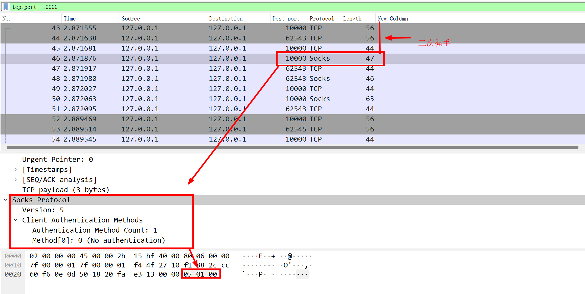
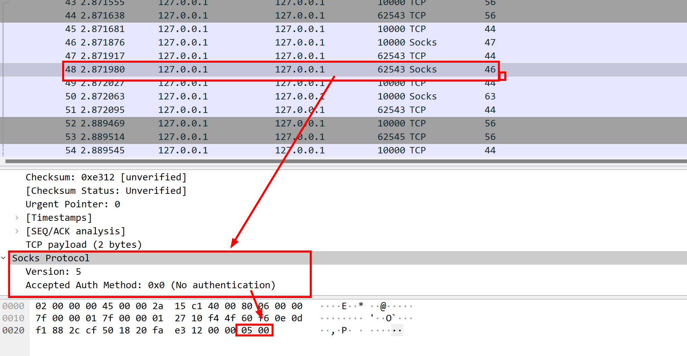
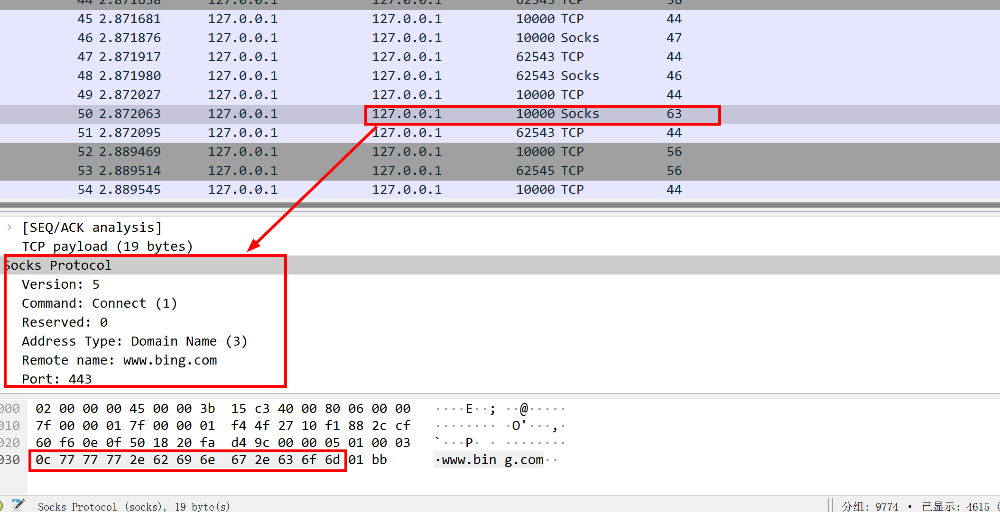
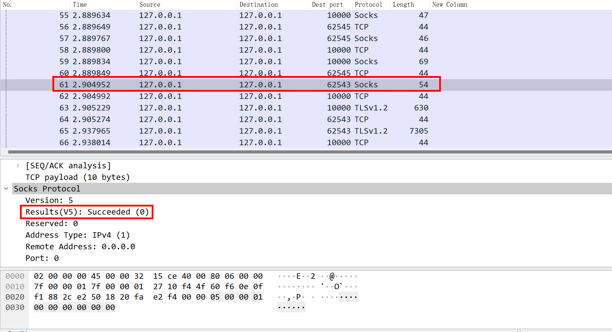

[TOC]


## 前言

[SOCKS](https://zh.wikipedia.org/zh-hans/SOCKS)是一种网络传输协议，主要用于客户端与外网服务器之间通讯的中间传递。协议在应用层和传输层之间。

本文使用先了解`socks`协议。然后实现一个socks5的tcp代理服务端。最后，进行抓包验证。

---

## socks协议简介

`socks`协议相对http和tcp协议，还是比较简单。当然，想要搞明白每个细节，也非一件容易的事情。

关于协议本身的介绍见：[rfc1928](https://datatracker.ietf.org/doc/html/rfc1928)、[RFC 1928 - SOCKS 5 协议中文文档「译」](https://www.quarkay.com/code/383/socks5-protocol-rfc-chinese-traslation)

文档总是枯燥的，可以边看文档边看代码：[实战：150行Go实现高性能socks5代理](https://segmentfault.com/a/1190000038247560)

---

## go实现一个简单的socks5代理

了解协议后，我们来实现一个tcp的socks5服务端代理。

网上有很多这样的示例，见：[socks - Search Results - Go Packages](https://pkg.go.dev/search?q=socks&m=)

本节的代码参考自：[实战：150行Go实现高性能socks5代理](https://segmentfault.com/a/1190000038247560) 、[Subsocks: 用 Go 实现一个 Socks5 安全代理 - Luyu Huang&#39;s Blog](https://luyuhuang.tech/2020/12/02/subsocks.html)

完整代码见仓库，下面是主要的代码。

```go
package socks5

import (
    "bufio"
    "encoding/binary"
    "errors"
    "fmt"
    "go-socks5-demo/config"
    "go-socks5-demo/utils"
    "io"
    "net"
    "strconv"

    log "github.com/sirupsen/logrus"
)

const SOCKS5VERSION uint8 = 5

const (
    MethodNoAuth uint8 = iota
    MethodGSSAPI
    MethodUserPass
    MethodNoAcceptable uint8 = 0xFF
)

const (
    RequestConnect uint8 = iota + 1
    RequestBind
    RequestUDP
)

const (
    RequestAtypIPV4       uint8 = iota
    RequestAtypDomainname uint8 = 3
    RequestAtypIPV6       uint8 = 4
)

const (
    Succeeded uint8 = iota
    Failure
    Allowed
    NetUnreachable
    HostUnreachable
    ConnRefused
    TTLExpired
    CmdUnsupported
    AddrUnsupported
)

type Proxy struct {
    Inbound struct {
        reader *bufio.Reader
        writer net.Conn
    }
    Request struct {
        atyp uint8
        addr string
    }
    OutBound struct {
        reader *bufio.Reader
        writer net.Conn
    }
}

func Start() error {
    // 读取配置文件中的监听地址和端口
    log.Debug("socks5 server start")
    listenPort := config.Conf.ListenPort
    listenIp := config.Conf.ListenIp
    if listenPort <= 0 || listenPort > 65535 {
        log.Error("invalid listen port:", listenPort)
        return errors.New("invalid listen port")
    }

    //创建监听
    addr, _ := net.ResolveTCPAddr("tcp", listenIp+":"+strconv.Itoa(listenPort))
    listener, err := net.ListenTCP("tcp", addr)
    if err != nil {
        log.Error("fail in listen port:", listenPort, err)
        return errors.New("fail in listen port")
    }

    // 建立连接
    for {
        conn, _ := listener.Accept()
        go socks5Handle(conn)
    }
}

func socks5Handle(conn net.Conn) {
    proxy := &Proxy{}
    proxy.Inbound.reader = bufio.NewReader(conn)
    proxy.Inbound.writer = conn

    err := handshake(proxy)
    if err != nil {
        log.Warn("fail in handshake", err)
        return
    }
    transport(proxy)
}

func handshake(proxy *Proxy) error {
    err := auth(proxy)
    if err != nil {
        log.Warn(err)
        return err
    }

    err = readRequest(proxy)
    if err != nil {
        log.Warn(err)
        return err
    }

    err = replay(proxy)
    if err != nil {
        log.Warn(err)
        return err
    }
    return err
}

func auth(proxy *Proxy) error {
    /*
        Read
           +----+----------+----------+
           |VER | NMETHODS | METHODS  |
           +----+----------+----------+
           | 1  |    1     | 1 to 255 |
           +----+----------+----------+
    */
    buf := utils.SPool.Get().([]byte)
    defer utils.SPool.Put(buf)

    n, err := io.ReadFull(proxy.Inbound.reader, buf[:2])
    if n != 2 {
        return errors.New("fail to read socks5 request:" + err.Error())
    }

    ver, nmethods := uint8(buf[0]), int(buf[1])
    if ver != SOCKS5VERSION {
        return errors.New("only support socks5 version")
    }
    _, err = io.ReadFull(proxy.Inbound.reader, buf[:nmethods])
    if err != nil {
        return errors.New("fail to read methods" + err.Error())
    }
    supportNoAuth := false
    for _, m := range buf[:nmethods] {
        switch m {
        case MethodNoAuth:
            supportNoAuth = true
        }
    }
    if !supportNoAuth {
        return errors.New("no only support no auth")
    }

    /*
        replay
            +----+--------+
            |VER | METHOD |
            +----+--------+
            | 1  |   1    |
            +----+--------+
    */
    n, err = proxy.Inbound.writer.Write([]byte{0x05, 0x00}) // 无需认证
    if n != 2 {
        return errors.New("fail to wirte socks method " + err.Error())
    }

    return nil
}

func readRequest(proxy *Proxy) error {
    /*
        Read
           +----+-----+-------+------+----------+----------+
           |VER | CMD |  RSV  | ATYP | DST.ADDR | DST.PORT |
           +----+-----+-------+------+----------+----------+
           | 1  |  1  | X'00' |  1   | Variable |    2     |
           +----+-----+-------+------+----------+----------+
    */
    buf := utils.SPool.Get().([]byte)
    defer utils.SPool.Put(buf)
    n, err := io.ReadFull(proxy.Inbound.reader, buf[:4])
    if n != 4 {
        return errors.New("fail to read request " + err.Error())
    }
    ver, cmd, _, atyp := uint8(buf[0]), uint8(buf[1]), uint8(buf[2]), uint8(buf[3])
    if ver != SOCKS5VERSION {
        return errors.New("only support socks5 version")
    }
    if cmd != RequestConnect {
        return errors.New("only support connect requests")
    }
    var addr string
    switch atyp {
    case RequestAtypIPV4:
        _, err = io.ReadFull(proxy.Inbound.reader, buf[:4])
        if err != nil {
            return errors.New("fail in read requests ipv4 " + err.Error())
        }
        addr = string(buf[:4])
    case RequestAtypDomainname:
        _, err = io.ReadFull(proxy.Inbound.reader, buf[:1])
        if err != nil {
            return errors.New("fail in read requests domain len" + err.Error())
        }
        domainLen := int(buf[0])
        _, err = io.ReadFull(proxy.Inbound.reader, buf[:domainLen])
        if err != nil {
            return errors.New("fail in read requests domain " + err.Error())
        }
        addr = string(buf[:domainLen])
    case RequestAtypIPV6:
        _, err = io.ReadFull(proxy.Inbound.reader, buf[:16])
        if err != nil {
            return errors.New("fail in read requests ipv4 " + err.Error())
        }
        addr = string(buf[:16])
    }
    _, err = io.ReadFull(proxy.Inbound.reader, buf[:2])
    if err != nil {
        return errors.New("fail in read requests port " + err.Error())
    }
    port := binary.BigEndian.Uint16(buf[:2])
    proxy.Request.atyp = atyp
    proxy.Request.addr = fmt.Sprintf("%s:%d", addr, port)
    log.Debug("request is", proxy.Request)
    return nil
}

func replay(proxy *Proxy) error {
    /*
        write
           +----+-----+-------+------+----------+----------+
           |VER | REP |  RSV  | ATYP | BND.ADDR | BND.PORT |
           +----+-----+-------+------+----------+----------+
           | 1  |  1  | X'00' |  1   | Variable |    2     |
           +----+-----+-------+------+----------+----------+
    */
    conn, err := net.Dial("tcp", proxy.Request.addr)
    if err != nil {
        log.Warn("fail to connect ", proxy.Request.addr)
        _, rerr := proxy.Inbound.writer.Write([]byte{SOCKS5VERSION, HostUnreachable, 0x00, 0x01, 0, 0, 0, 0, 0, 0})
        if rerr != nil {
            return errors.New("fail in replay " + err.Error())
        }
        return errors.New("fail in connect addr " + proxy.Request.addr + err.Error())
    }
    _, err = proxy.Inbound.writer.Write([]byte{SOCKS5VERSION, Succeeded, 0x00, 0x01, 0, 0, 0, 0, 0, 0})
    if err != nil {
        return errors.New("fail in replay " + err.Error())
    }
    proxy.OutBound.reader = bufio.NewReader(conn)
    proxy.OutBound.writer = conn
    return nil
}

func transport(proxy *Proxy) {
    // 语义上是注释的动作;但是iobuf.reader中无法获取rd值
    // io.Copy(proxy.OutBound.writer, proxy.Inbound.reader)
    go io.Copy(proxy.OutBound.writer, proxy.Inbound.writer) // outbound <- inbound
    // io.Copy(proxy.Inbound.writer, proxy.OutBound.reader)
    go io.Copy(proxy.Inbound.writer, proxy.OutBound.writer) // inbound <- outbound
}

```

---

## 运行与压测

运行测试：可以在浏览器中安装和配置下[Proxy SwitchyOmega](https://chrome.google.com/webstore/detail/proxy-switchyomega/padekgcemlokbadohgkifijomclgjgif?hl=zh-CN)。插件将http流量转换成socks5，流量通过代理，浏览器可正常上网。访问百度，看B站都没问题。

压测：略。

---

## 抓包验证

关于wireshare的使用，可见：[wireshark入门指北](https://blog.csdn.net/sinat_38816924/article/details/132166085)

1. 客户端连接到 SOCKS 服务端，发送的协议版本与方法选择消息。

    ```shell
    +----+----------+----------+
    |VER | NMETHODS | METHODS  |
    +----+----------+----------+
    | 1  |    1     | 1 to 255 |
    +----+----------+----------+
    ```

    

    socks5--客户端只支持1种方法--不验证

2. 服务器从给出的方法进行选择，并且发送方法选择消息

    ```shell
    +----+--------+
    |VER | METHOD |
    +----+--------+
    | 1  |   1    |
    +----+--------+
    ```

    

    socks5--不验证

3. 客户端发送要请求的目标地址。

    ```shell
    +----+-----+-------+------+----------+----------+
    |VER | CMD |  RSV  | ATYP | DST.ADDR | DST.PORT |
    +----+-----+-------+------+----------+----------+
    | 1  |  1  | X'00' |  1   | Variable |    2     |
    +----+-----+-------+------+----------+----------+
    ```

    

    客户端，告诉服务端：要请求`www.bing.com`,目标端口是443。

4. 服务端根据请求信息，去建立连接。并返回连接情况。

    ```shel
    +----+-----+-------+------+----------+----------+
    |VER | REP |  RSV  | ATYP | BND.ADDR | BND.PORT |
    +----+-----+-------+------+----------+----------+
    | 1  |  1  | X'00' |  1   | Variable |    2     |
    +----+-----+-------+------+----------+----------+  
    ```

    

    服务单与目标地址连接成功。这里没有设置与目标建立连接的地址和端口。对于UDP而言，这里必须返回。因为客户端与服务端协商完之后，客户端需要将udp的流量发送到这个地址和端口。

5. socks协议到这里已经结束。后面则是数据转发。由于转发过程是在传输层。所以无论是http还是https，该代理程序都可以很好的运行。