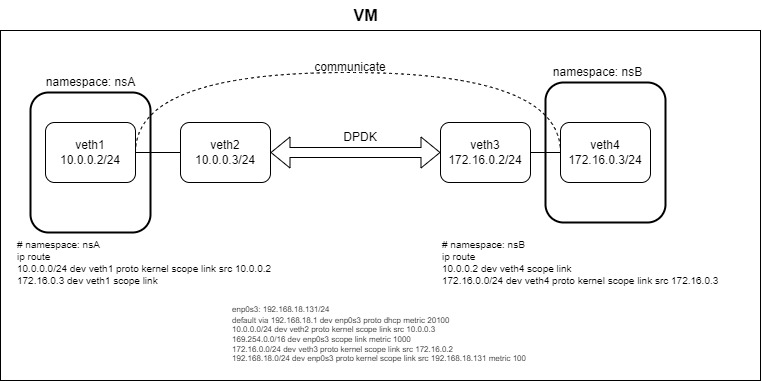
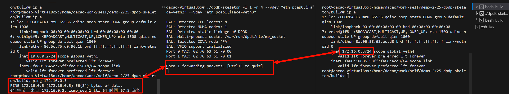
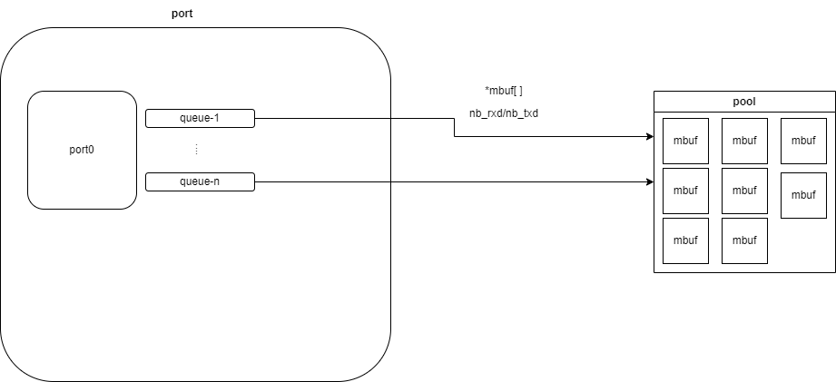

[toc]

# dpdk网络转发环境的搭建

## 前言

上手dpdk有两难。其一为环境搭建。被绑定之后的网卡没有IP，我如何给它发送数据呢？当然，可以通过网桥将一个正常的网卡和被绑定的网卡互相连接。但对于日常写demo实验中，这并不方便。本文尝试用vire-pair来避免使用硬件网桥，使用namespace来隔离网络。其二是，关于端口初始化。我没有搞清楚每个选项设置的必然原因，但是这里会列出端口初始化的基本流程。

最后验证，借助[Basic Forwarding Sample Application — Data Plane Development Kit 23.11.0 documentation](https://doc.dpdk.org/guides/sample_app_ug/skeleton.html)可以将网络上不相连接两个端口，可以互相ping通。但是在验证tcp转发的时候，抓包显示tcp checksum incorrect。相关报错循序见后文。凡事必有原因，但是我昨晚睡得很晚，现在脑子不太清醒，故不想理会这个问题。

注：本文验证网络转发的代码来自[dpdk/examples/skeleton at main · DPDK/dpdk](https://github.com/DPDK/dpdk/tree/main/examples/skeleton)。我将它移动到该仓库目录中。

---

## ip命令的使用

在组建虚拟网络结构之前，我们需要先了解IP命令的使用。参考自：
1. [ip 命令 - Router Lab 实验文档](https://lab.cs.tsinghua.edu.cn/router/doc/appendix/ip/#ip-link)
2. [ip(8) - Linux man page](https://linux.die.net/man/8/ip)

ip命令的总体组成如下。

```shell
ip [ OPTIONS ] OBJECT { COMMAND | help }

OBJECT := { link | addr | addrlabel | route | rule | neigh | tunnel | maddr | mroute | monitor }

OPTIONS := { -V[ersion] | -s[tatistics] | -r[esolve] | -f[amily] { inet | inet6 | ipx | dnet | link } | -o[neline] }
```

**ip address - protocol address management**.

每个设备必须有一个IP地址，才能使用对应的协议(IPV4/IPV6)。可以通过`ip address help`查看使用方法。

```shell
# 列出所有网口信息和地址信息
ip address show

# 设置网络
ip addr add $addr/$prefix_len dev $interface
```

**ip link - network device configuration**。

使用`ip link`来显示和修改网络设备的状态。具体使用方法，可以通过help查看。

```shell
# 查看设备状态
ip link show

# 创建两个虚拟以太网设备，它们之间直接相连
## ref: https://man7.org/linux/man-pages/man4/veth.4.html
### 在一对设备中的一个设备上传输的数据包会立即在其他设备上收到。当任一设备出现故障时，该对的链路状态为关闭。
### 这两个veth可以处在不同的网络命名空间中
## 如果有天希望三个veth可以互通，这似乎有点麻烦，我还没搞明白：https://superuser.com/questions/764986/howto-setup-a-veth-virtual-network
## 这里还有篇veth-pair配置的不错的介绍：https://www.cnblogs.com/bakari/p/10613710.html
ip link add $name1 type veth peer name $name2
```

**ip route - routing table management**.

操纵路由表。

```shell
# 查看路由表
ip route show
```

---

## 配置dpdk-basicfwd需要的网络结构

了解了ip命令的基本使用后，我们来配置下dpdk-basicfwd所需的网络结构。网络中包含：两对veth-pair, 其中veth1和veth2互连，veth3和veth4互连; veth1在名为nsA的namespace中; veth4在名为nsB的namespace中; dpdk-basicfwd将veth2收到的流量转发到veth3,veth3收到的流量转发到veth2; 网络总体结构图如下所示：



下面我们按照上图所示，进行网络创建。

先设置一对虚拟以太网卡，并设置IP/mask。注意此时这两者无法互相ping通，但是可以通过lo口互通的，见:  [Linux 虚拟网络设备 veth-pair 详解，看这一篇就够了 - bakari - 博客园](https://www.cnblogs.com/bakari/p/10613710.html)

```shell
ip link add veth1 type veth peer name veth2
ip link set veth1 up
ip link set veth2 up
ip address add 10.0.0.2/24 dev veth1
ip address add 10.0.0.3/24 dev veth2

#测试下上面的配置是否可以联通。
## -l表示listen; -s表示veth2在80开启监听端口; 
## -k表示处理完一个连接后继续监听新的连接，而不是退出
#nc -k -l -s 10.0.0.3 -p 80

## 从10.0.0.2发出流量到10.0.0.3:80 端口
#echo "hello world" |  nc -s 10.0.0.2 -w 1 10.0.0.3 80
```

接着，我们再设置另一对虚拟以太网。

```shell
ip link add veth3 type veth peer name veth4
ip link set veth3 up
ip link set veth4 up
ip address add 172.16.0.2/24 dev veth3
ip address add 172.16.0.3/24 dev veth4
```

为了避免veth1和veth4通过lo口进行通信。将veth1和veth4放在不同的namespace中。

```shell
# 添加两个命名空间
ip netns add nsA
ip netns add nsB

# 将veth1加入命名空间nsA; 需要重写进行网卡信息的配置
## 此时veth1能ping通veth2了
ip link set veth1 netns nsA
ip netns exec nsA  /bin/bash
ip link set veth1 up
ip address add 10.0.0.2/24 dev veth1
ping 10.0.0.3

# 将veth4加入命名空间nsB; 然后进入命名空间,设置ip并启用
## 此时veth4能ping通veth3了
ip link set veth4 netns nsB
ip netns exec nsB  /bin/bash
ip link set veth4 up
ip address add 172.16.0.3/24 dev veth4
ping 172.16.0.2
```

端口配置后，还需要设置下路由：在nsA中，让访问veth4的流量，从veth1端口走。在nsB中，让访问veth1的流量，从veth4端口走。

```shell
# nsB中
ip netns exec nsB  /bin/bash
ip route add 10.0.0.2 dev veth4
# tcpdump -nn -vv -l -i veth4
# nc -k -l -s 172.16.0.3 -p 80

# nsA中
ip netns exec nsA  /bin/bash
ip route add 172.16.0.3 dev veth1
# ping 172.16.0.3
# echo "hello world" |  nc -s 10.0.0.2 -w 5 172.16.0.3 80
```

最终的结果：
* veth1和veth2可以通过veth-pair跨namespcae通信。
* veth3和veth4可以通过veth-pair跨namespcae通信。
* 但是veth1和veth2由于不在同一个namespace,又没有veth-pair，所以相互之间无法通信。

---

## 测试dpdk-basicfwd

为什么`--vdev`这个参数可以呢，它是什么原理？我也不知道，照葫芦画瓢参考自：[odp-dpdk/platform/linux-dpdk/README at master · OpenDataPlane/odp-dpdk](https://github.com/OpenDataPlane/odp-dpdk/blob/master/platform/linux-dpdk/README)

```shell
./dpdk-skeleton -l 1 -n 4 --vdev "eth_pcap0,iface=veth2" --vdev "eth_pcap1,iface=veth3"
```



---

## dpdk-basicfwd代码分析

200行的代码，很快就能看完一遍。具体的API使用见官方文档，这里简述下流程。

首先是内存池和cpu相关的初始化，这个和存储架构相关。大体知道知道这些含义即可：NUMA node > socket > core > logical processor。相关内容见：[CPU 拓扑：从 SMP 谈到 NUMA （理论篇） | 猿大白](https://ctimbai.github.io/2018/05/10/tech/linux/cpu/CPU%E6%8B%93%E6%89%91%EF%BC%9A%E4%BB%8ESMP%E8%B0%88%E5%88%B0NUMA%EF%BC%88%E5%AE%9E%E8%B7%B5%E7%AF%87%EF%BC%89/)

接着是端口相关的初始化，简单的基本流程是：查看当前端口的信息->对端口进行配置->设置总共的接收/发送描述符数->每个队列可以使用的接收/发送描述符数。这部分的结构**可能**是这样的。




然后就是转发。从一个端口接收到数据，然后让另一个端口发送这部分数据。

---

## 附录

### basicfwd在tcp转发时的失败抓包信息

```shell

# nsB中启动监听
nc -l -s 172.16.0.3 -p 80

# nsA中发起请求
echo "hello world" |  nc -s 10.0.0.2 -w 5 172.16.0.3 80

# nsB中抓包信息
tcpdump -nn -vv -l -i veth4
tcpdump: listening on veth4, link-type EN10MB (Ethernet), capture size 262144 bytes
22:24:39.112851 IP (tos 0x0, ttl 64, id 21121, offset 0, flags [DF], proto TCP (6), length 60)
    10.0.0.2.38177 > 172.16.0.3.80: Flags [S], cksum 0xb643 (incorrect -> 0xfc92), seq 2659543870, win 64240, options [mss 1460,sackOK,TS val 3763804890 ecr 0,nop,wscale 7], length 0
22:24:40.136180 IP (tos 0x0, ttl 64, id 21122, offset 0, flags [DF], proto TCP (6), length 60)
    10.0.0.2.38177 > 172.16.0.3.80: Flags [S], cksum 0xb643 (incorrect -> 0xf893), seq 2659543870, win 64240, options [mss 1460,sackOK,TS val 3763805913 ecr 0,nop,wscale 7], length 0
22:24:42.232702 IP (tos 0x0, ttl 64, id 21123, offset 0, flags [DF], proto TCP (6), length 60)
    10.0.0.2.38177 > 172.16.0.3.80: Flags [S], cksum 0xb643 (incorrect -> 0xf05f), seq 2659543870, win 64240, options [mss 1460,sackOK,TS val 3763808013 ecr 0,nop,wscale 7], length 0
22:24:44.140469 ARP, Ethernet (len 6), IPv4 (len 4), Request who-has 172.16.0.3 tell 10.0.0.2, length 28
22:24:44.140480 ARP, Ethernet (len 6), IPv4 (len 4), Reply 172.16.0.3 is-at 8a:06:58:68:ec:d8, length 2
```

---

### DPDK的相关设置

**绑定网卡**。

ip命令创建的虚拟以太网卡，`dpdk-devbind.py`是无法绑定的。如果绑定真实的网卡，需要先有驱动，然后进行绑定。

```shell
# 包管理器方式下载驱动
## ubuntu
sudo apt install dpdk-igb-uio-dkms

# 源码编译的方式生成驱动
# 编译igb_uio驱动; 在wsl中会编译失败，需要在linux环境中编译
git clone git://dpdk.org/dpdk-kmods
cd dpdk-kmods/linux 
make

# 绑定网卡
## 先停止网卡
ip link set enp0s3  down
## 然后安装驱动模块
modprobe igb_uio
## 然后绑定网卡
./dpdk-devbind.py --bind=igb_uio enp0s3
## 查看绑定后的信息
./dpdk-devbind.py --status
```

**dpdk源码编译**

关于编译参数，自行参考官方手册和源码。

```shell
git clone git@github.com:DPDK/dpdk.git

# 初学还是不要直接用dev分支的代码比较好。
## 我踩了一个坑：ALLOW_EXPERIMENTAL_API这个宏，在dev中是默认开启的，但是在发布的tag中是关闭的
git checkout v23.11

# cpu_instruction_set还是设置为corei7吧。
## 如果不设置这个选项，在dev分支中，debug版本调试的时候，会出现crash，提示指令相关的报错
meson setup -Dcpu_instruction_set=corei7 -Dbuildtype=debug -Dexamples=all -Dprefix=/home/dacao/work/3rdlib/dpdk build
cd build
ninja 
ninja install
```

**在cmake中链接dpdk库**。

自行编写的dpdk程序链接dpdk库的时候，要加上`--whole-archive`。否则不会将pmd相关的库不会打包到程序中。在CmakeLists中使用pkgconfig, 不会带上`--whole-archive`这个参数。原因我不知道到。我还没有去查阅pkgconfig的文件格式和cmake对其的使用。可以使用下面的配置。

```cmake
cmake_minimum_required(VERSION 3.11)

project(dpdk-skeleton)

# arch的参数和编译dpdk时的cpu_instruction_set参数保持一致
set(CMAKE_C_FLAGS "${CMAKE_C_FLAGS} -march=corei7")
set(CMAKE_CXX_FLAGS "${CMAKE_CXX_FLAGS} -march=corei7")

find_package(PkgConfig REQUIRED)
pkg_check_modules(LIBDPDK REQUIRED libdpdk)
include_directories(${LIBDPDK_STATIC_INCLUDE_DIRS})
# link_directories(${LIBDPDK_STATIC_LIBRARY_DIRS})
# message(STATUS "LIBDPDK_STATIC_LIBRARIES: ${LIBDPDK_STATIC_LIBRARIES}")
# message(STATUS "LIBDPDK_STATIC_INCLUDE_DIRS: ${LIBDPDK_STATIC_INCLUDE_DIRS}")
message(STATUS "LIBDPDK_LIBDIR: ${LIBDPDK_LIBDIR}")

add_custom_target(compress_dpdk_libraries
    COMMAND rm -rf libdpdks.a
    COMMAND sh -c "ar crsT libdpdks.a ./librte*.a"
    WORKING_DIRECTORY ${LIBDPDK_LIBDIR}
    COMMENT "Compressing static libraries"
)

find_library(M_LIB m)
add_library(libdpdk STATIC IMPORTED GLOBAL)
add_dependencies(libdpdk compress_dpdk_libraries)
set_target_properties(libdpdk PROPERTIES
    IMPORTED_LOCATION ${M_LIB}
    INTERFACE_LINK_LIBRARIES "-Wl,--whole-archive;${LIBDPDK_LIBDIR}/libdpdks.a;-Wl,--no-whole-archive;rt;m;numa;fdt;atomic;mlx5;ibverbs;crypto;z;jansson;mlx4;pcap;isal;elf;pthread;dl;bsd"
)

add_executable(${PROJECT_NAME} basicfwd.c)
target_link_libraries(${PROJECT_NAME} PRIVATE libdpdk)
```

**多台虚拟机之间组网**。

上面是在一台虚拟机中进行组网测试。如果不想这么做，想让两台虚拟机之间的网卡通过网桥互连。可以参考下面的做法：不同组的网卡使用不同名称的网络适配器机进行网络隔离。

* [在VirtualBox上搭建DPDK数据包转发运行环境 - 黑牛2008的个人空间 - OSCHINA - 中文开源技术交流社区](https://my.oschina.net/u/187439/blog/272050)
* [dpdk l3fwd/l2fwd实验-CSDN博客](https://blog.csdn.net/wangquan1992/article/details/122348507)
* [2.VMware三种网络模式 - certainTao - 博客园](https://www.cnblogs.com/certainTao/p/15643455.html)