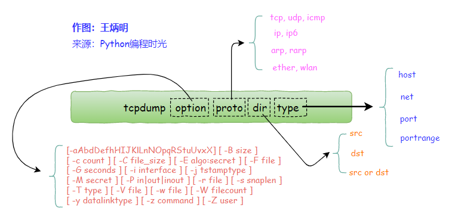

[toc]

# 前言

因为之前简单写过[wireshark入门指北](https://blog.csdn.net/sinat_38816924/article/details/132166085)，所以我知道基本的抓包流程。最近尝试调用[libpcap](https://www.tcpdump.org/manpages/pcap.3pcap.html)的C API接口，顺道整理下。

本文实验如下：
1. 使用[tcpdump](https://www.tcpdump.org/manpages/tcpdump.1.html)命令抓取目标地址为百度的一个数据包，并将结果保存文件。
2. 使用tcpdump加载上面的数据包。
3. 使用libpcap的API，实现上面的两个过程。

注：本文代码仅考虑在Linux环境下运行。

---

# tcpdump的使用

如果是第一次使用tcpdump，会感觉这个命令的参数咋这么多，令人摸不着头脑。于是，每次需要写tcpdump命令，都要去问chatgpt，就像写正则一样。下面，我们将搞懂这个命令参数的结构，以后写tcpdump命令也会比较轻松。

我们去看它的官方文档，会看到tcpdump命令参数如下：

```shell
tcpdump [ -AbdDefhHIJKlLnNOpqStuUvxX# ] [ -B buffer_size ]
         [ -c count ] [ --count ] [ -C file_size ]
         [ -E spi@ipaddr algo:secret,... ]
         [ -F file ] [ -G rotate_seconds ] [ -i interface ]
         [ --immediate-mode ] [ -j tstamp_type ]
         [ --lengths ] [ -m module ]
         [ -M secret ] [ --number ] [ --print ]
         [ --print-sampling nth ] [ -Q in|out|inout ] [ -r file ]
         [ -s snaplen ] [ -T type ] [ --version ] [ -V file ]
         [ -w file ] [ -W filecount ] [ -y datalinktype ]
         [ -z postrotate-command ] [ -Z user ]
         [ --time-stamp-precision=tstamp_precision ]
         [ --micro ] [ --nano ]
         [ expression ]
```

可以看到参数分为两部分。其中一部分是tcpdump的option。另一部分是expression。expression是一个[pcap-filter](https://www.tcpdump.org/manpages/pcap-filter.7.html)。（这个expression是大名鼎鼎的BPF expression。如果不知道BPF，不影响。我之前接触过点bpf，所以概念上理解起来很轻松：[bpf简介1](https://da1234cao.blog.csdn.net/article/details/115471891)）

这张图，可以很好的显示tcpdump命令的结构。图片来自：[全网最详细的 tcpdump 使用指南](https://www.cnblogs.com/wongbingming/p/13212306.html)。



1. option：tcpdump命令的选项。
2. expressio：proto、dir和type组成一个BPF完整表达式的基元。这些基元可以通过and,or,not来组合。

下面我们实际使用tcpdump命令试试。

```shell
# 抓包内容输出到标准输出。
## -nn:不把协议和端口号转化成名字; -vv:产生比-v更详细的输出; -i:指定网卡; 引号中的是BPF表达式，表抓取目标地址为百度的数据包
tcpdump -nn -vv -i enp0s3 "dst host www.baidu.com"

# -c:控制抓包个数; -w:抓包内容写入文件
tcpdump -nn -vv -i enp0s3 -c 1 -w baidu.pcap "dst host www.baidu.com"

# 读取包中的内容
tcpdump -r baidu.pcap
```

---

# libpcap API的简单使用

