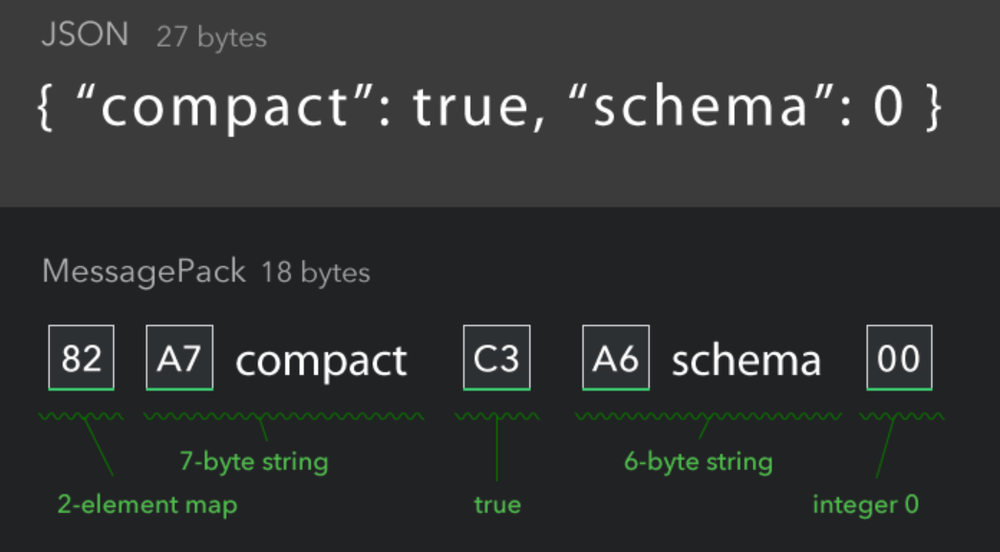
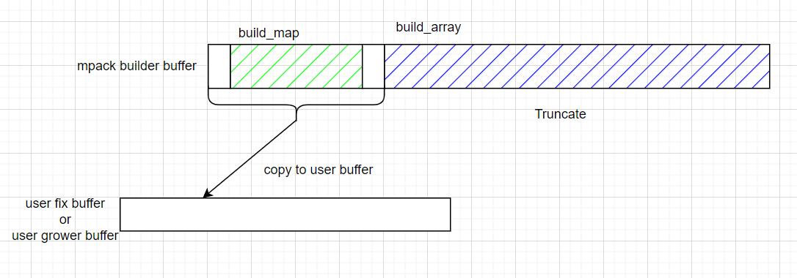

# mpack简明教程

[toc]

## 摘要

本文先简单介绍MessagePack的基本概念。

然后，介绍一个MessagePack C API - MPack的通常使用。

接着尝试对MPack截断数据的读取。

注：本文完整代码见仓库。

---

## MessagePack简介

如果你使用过C/C++的json库，那么上手[MessagePack](https://msgpack.org/)是比较容易的。关于C/C++ Json库的使用可见：[C++ JSON库的一般使用方法-CSDN博客](https://blog.csdn.net/sinat_38816924/article/details/129812633)。

这里，我先说下结论，对于用户层面而言，MessagePack相对于json节省空间，但牺牲了可读性(对于人类而言)。（更多区别见：[Why Not Just Use JSON?](https://github.com/ludocode/mpack?tab=readme-ov-file#why-not-just-use-json)）

下面我们来看两个示例，了解下MessagPack是如何压缩json内容。这个压缩过程，遵循[MessagePack specification(MessagePack规范)](https://github.com/msgpack/msgpack/blob/master/spec.md)

第一个示例，来自MessagePack首页。它将27个字节的JSON内容，压缩到18个字节。



我们根据MessagePack规范来看下上面是如何压缩的。

```shell
# 82的含义
## 对于元素个数不超过15个的map存储，遵循如下格式
## 82 == 1000 0010 表示该结构为map，有两个元素
+--------+~~~~~~~~~~~~~~~~~+
|1000XXXX|   N*2 objects   |
+--------+~~~~~~~~~~~~~~~~~+

# A7的含义
## 对于长度不超过31的固定长度字符串存储，遵循如下格式
## A7 == 1010 0111 表示该结构为字符串，有7个字符
+--------+========+
|101XXXXX|  data  |
+--------+========+

# C3含义
## false:
+--------+
|  0xc2  |
+--------+
## true:
+--------+
|  0xc3  |
+--------+

# A6的含义--略，查询过程同上面A7

# 00的含义
## 可以使用7-bit存储的正整数，遵循如下格式
## 00 = 0000 0000
+--------+
|0XXXXXXX|
+--------+
```

我们再来看一个示例，练习下。这个示例来自： [mpack/docs/expect.md at develop · ludocode/mpack](https://github.com/ludocode/mpack/blob/develop/docs/expect.md)

```json
[
  "hello",
  "world!",
  [
    1,
    2,
    3,
    4
  ]
]
```

上面这个json，使用MessagPack编码如下。

```shell
93                     # an array containing three elements
  a5 68 65 6c 6c 6f    # "hello"
  a6 77 6f 72 6c 64 21 # "world!"
  94                   # an array containing four elements
    01                 # 1
    02                 # 2
    03                 # 3
    04                 # 4
```

---

## MPACK的简单使用

了解了MessagePack的概念之后，我们看下它的C api的使用。[MPACK](https://github.com/ludocode/mpack)是MessagePack C语言实现的API之一。mpack的stars没有[msgpack-c](https://github.com/msgpack/msgpack-c)多。但是mpack对libc的版本没有要求。下面是对mpack的使用教程。

JSON的使用包含两个部分：将json数据写入内存/文件；从已有的json数据中读取内容。

mapck在使用结构上，和json类似，分为写和读。[MPack api](https://ludocode.github.io/mpack/modules.html)是mpack的api文档，接口使用的详细介绍见文档。写数据的部分调用`Write API`。如果没有内存限制，读取的时候使用`Node API`。如果有内存限制，则使用`Reader API`+`Expect API`。(这里说的内存限制是指，程序运行的内存限制，而不是数据存储的内存限制)

这个参考示例不错，在开始之前，可以一读：[一个C语言MessagePack库：mpack](https://blog.acct.bid/archives/72)

下面我们开始写demo。写一个最简单，也是最常用的demo：存储数据的内存无限制时，使用mpack进行数据的写入和读取。示例参考自官方的README:[ludocode/mpack: MPack - A C encoder/decoder for the MessagePack serialization format / msgpack.org[C]](https://github.com/ludocode/mpack). 这里对这些API进行简单的介绍，详细介绍见官方文档。

* `mpack_writer_init_growable(mpack_writer_t* writer, char** target_data, size_t* target_size)`使用一个会增长的buffer。
* 在调用`mpack_writer_destroy`后，将上面`target_data`指向写入数据的地址。
* 最后必须调用`MPACK_FREE()`释放申请的数据。
* 使用`mpack_build_map`开始构建一个map，我们此时不知道map中元素的个数。如果知道元素个数，使用`mpack_start_map()`替代。
* 使用`mpack_build_map`后，后面必须跟偶数个数的元素，在结束的时候调用 `mpack_complete_map()`。
* 使用`Node API`读取数据。

```c
#include "mpack.h"
#include <stdio.h>

/*
{
    "name": "3-1",
    "number": 56,
    "students": [
        {
            "name": "zhangsan",
            "score": 76.8
        },
        {
            "name": "lisi",
            "score": 77
        }
    ]
}
*/

mpack_error_t class_information_serialize(char **data, size_t *size) {
  mpack_writer_t writer;
  mpack_writer_init_growable(&writer, data, size);

  mpack_build_map(&writer);

  mpack_write_cstr(&writer, "name");
  mpack_write_cstr(&writer, "3-1");

  mpack_write_cstr(&writer, "number");
  mpack_write_u8(&writer, 56);

  mpack_write_cstr(&writer, "students");
  mpack_build_array(&writer);

  mpack_start_map(&writer, 2);
  mpack_write_cstr(&writer, "name");
  mpack_write_cstr(&writer, "zhangsan");
  mpack_write_cstr(&writer, "score");
  mpack_write_float(&writer, 76.8);
  mpack_finish_map(&writer);

  mpack_start_map(&writer, 2);
  mpack_write_cstr(&writer, "name");
  mpack_write_cstr(&writer, "lisi");
  mpack_write_cstr(&writer, "score");
  mpack_write_float(&writer, 77);
  mpack_finish_map(&writer);

  mpack_complete_array(&writer);

  mpack_complete_map(&writer);

  mpack_error_t ret = mpack_writer_destroy(&writer);

  return ret;
}

mpack_error_t class_information_deserialize(const char *data, size_t length) {
  mpack_tree_t tree;
  mpack_tree_init_data(&tree, data, length);
  mpack_tree_parse(&tree);

  mpack_node_t root = mpack_tree_root(&tree);
  const char *name = mpack_node_str(mpack_node_map_cstr(root, "name"));
  size_t name_len = mpack_node_strlen(mpack_node_map_cstr(root, "name"));
  uint8_t number = mpack_node_u8(mpack_node_map_cstr(root, "number"));
  printf("name:%.*s\n", name_len, name);
  printf("number:%u\n", number);

  printf("students:\n");
  mpack_node_t students = mpack_node_map_cstr(root, "students");
  size_t student_num = mpack_node_array_length(students);
  for (unsigned int i = 0; i < student_num; i++) {
    mpack_node_t student = mpack_node_array_at(students, i);
    const char *name = mpack_node_str(mpack_node_map_cstr(student, "name"));
    size_t name_len = mpack_node_strlen(mpack_node_map_cstr(student, "name"));
    float score = mpack_node_float(mpack_node_map_cstr(student, "score"));
    printf("  name:%.*s\n", name_len, name);
    printf("  score:%.2f\n", score);
  }

  mpack_error_t ret = mpack_tree_destroy(&tree);
  return ret;
}

int main(int argc, char *argv[]) {
  char *data = NULL;
  size_t size = 0;
  class_information_serialize(&data, &size);
  class_information_deserialize(data, size);
  MPACK_FREE(data);
}
```

程序输出如下。

```shell
name:3-1
number:56
students:
  name:zhangsan
  score:76.80
  name:lisi
  score:77.00
```

---

## 在定长的buffer存储不定长的数据

工作的时候，会想使用比较奇怪的调用。首先，所有的数据都要存储在一个定长的buffer里面。因为这个buffer是从一个内存池中取出的，所以它的长度是定长的。但是，往里面写入数据的时候，会写多次，长度不一定。

修改上面的示例：现在要写入不定个数的student到数组中；允许截断；

截断的时候发生了什么？截断后还能否读取？

遇到截断，writer会设置错误的标记位。正常编码的时候，这个writer数据不应该在后续进行读取。因为它已经被标记为错误。

但是，总有些头铁的需求，想用发生截断时，已经写入内存的数据。这个从API文档里面是看不出来的，要看mpack的源码。

我先说结论：
* 从前往后，不断将build中的内容，复制写入buffer。写之前检查空间是否足够，不够则停止写入，并标记错误。
* 使用 node api 无法读取。因为数据被截断，不合法。

大体结构图如下。



示例代码如下。

```c
#include "mpack.h"
#include <stdio.h>

/*
{
    "name": "3-1",
    "number": 56,
    "students": [
        {
            "name": "zhangsan",
            "score": 76.8
        },
        {
            "name": "lisi",
            "score": 77
        }
    ]
}
*/

mpack_error_t class_information_serialize(char *data, size_t *size) {
  mpack_writer_t writer;
  mpack_writer_init(&writer, data, *size);

  mpack_build_map(&writer);

  mpack_write_cstr(&writer, "name");
  mpack_write_cstr(&writer, "3-1");

  mpack_write_cstr(&writer, "number");
  mpack_write_u8(&writer, 56);

  mpack_write_cstr(&writer, "students");

  mpack_build_array(&writer);

  for (unsigned int i = 0; i < 56; i++) {
    mpack_start_map(&writer, 2);
    mpack_write_cstr(&writer, "name");
    mpack_write_cstr(&writer, "zhangsan");
    mpack_write_cstr(&writer, "score");
    mpack_write_float(&writer, 76.8);

    if (mpack_writer_error(&writer) != mpack_ok) {
      printf("error_%u: %d\n", i, mpack_writer_error(&writer));
    }
    mpack_finish_map(&writer);
  }

  mpack_complete_array(&writer);

  mpack_complete_map(&writer);

  if (mpack_writer_error(&writer) != mpack_ok) {
    printf("after write all students error: %d\n", mpack_writer_error(&writer));
  }

  *size = mpack_writer_buffer_used(&writer);
  mpack_error_t ret = mpack_writer_destroy(&writer);

  return ret;
}

mpack_error_t class_information_deserialize(const char *data, size_t length) {
  mpack_tree_t tree;
  mpack_tree_init_data(&tree, data, length);
  mpack_tree_parse(&tree);

  if (mpack_tree_error(&tree) != mpack_ok) {
    printf("parse tree error: %d\n", mpack_tree_error(&tree));
  }

  mpack_node_t root = mpack_tree_root(&tree);
  const char *name = mpack_node_str(mpack_node_map_cstr(root, "name"));
  size_t name_len = mpack_node_strlen(mpack_node_map_cstr(root, "name"));
  uint8_t number = mpack_node_u8(mpack_node_map_cstr(root, "number"));
  printf("name:%.*s\n", name_len, name);
  printf("number:%u\n", number);

  printf("students:\n");
  mpack_node_t students = mpack_node_map_cstr(root, "students");
  size_t student_num = mpack_node_array_length(students);
  for (unsigned int i = 0; i < student_num; i++) {
    mpack_node_t student = mpack_node_array_at(students, i);
    const char *name = mpack_node_str(mpack_node_map_cstr(student, "name"));
    size_t name_len = mpack_node_strlen(mpack_node_map_cstr(student, "name"));
    float score = mpack_node_float(mpack_node_map_cstr(student, "score"));
    printf("  name:%.*s\n", name_len, name);
    printf("  score:%.2f\n", score);
  }

  mpack_error_t ret = mpack_tree_destroy(&tree);
  return ret;
}

int main(int argc, char *argv[]) {
#define DATA_BUFFER_SIZE 35
  char data[DATA_BUFFER_SIZE] = {0};
  size_t size = DATA_BUFFER_SIZE;
  class_information_serialize(data, &size);
  class_information_deserialize(data, size);
}
```

输出如下。

```shell
after write all students error: 6
parse tree error: 3
name:
number:0
students:
```

---

## 读取截断的数据

既然使用`node api`解析数据会失败。那不要解析，顺序读取，一直读取到异常。

参考自：[Using the Expect API](https://github.com/ludocode/mpack/blob/develop/docs/expect.md)。代码如下。

```c
#include "mpack.h"
#include <stdio.h>

/*
[
  {
    "name": "zhangsan",
    "score": 76.8
  },
  {
    "name": "lisi",
    "score": 77
  }
  ...
]

*/

mpack_error_t class_information_serialize(char *data, size_t *size) {
  mpack_writer_t writer;
  mpack_writer_init(&writer, data, *size);

  mpack_build_array(&writer);

  for (unsigned int i = 0; i < 56; i++) {
    mpack_build_map(&writer);
    mpack_write_cstr(&writer, "name");
    mpack_write_cstr(&writer, "zhangsan");
    mpack_write_cstr(&writer, "score");
    mpack_write_float(&writer, 76.8);
    mpack_complete_map(&writer);
  }

  mpack_complete_array(&writer);

  if (mpack_writer_error(&writer) != mpack_ok) {
    printf("after write all students error: %d\n", mpack_writer_error(&writer));
  }

  *size = mpack_writer_buffer_used(&writer);
  mpack_error_t ret = mpack_writer_destroy(&writer);

  return ret;
}

mpack_error_t class_information_deserialize(const char *data, size_t length) {
  mpack_reader_t reader;
  mpack_reader_init_data(&reader, data, length);

  uint32_t students_num = mpack_expect_array(&reader);
  printf("students num: %u\n", students_num);
  for (unsigned int i = 0; i < students_num; i++) {
    uint32_t elem_cnt = mpack_expect_map(&reader);
    mpack_expect_cstr_match(&reader, "name");
    char name[20];
    size_t name_len = mpack_expect_str_buf(&reader, name, 20);
    mpack_expect_cstr_match(&reader, "score");
    float score = mpack_expect_float(&reader);

    if (mpack_reader_error(&reader) != mpack_ok) {
      break;
    }

    printf("name:%.*s\n", name_len, name);
    printf("score:%.2f\n", score);
    mpack_done_map(&reader);
  }

  return mpack_ok;
}

int main(int argc, char *argv[]) {
#define DATA_BUFFER_SIZE 100
  char data[DATA_BUFFER_SIZE] = {0};
  size_t size = DATA_BUFFER_SIZE;
  class_information_serialize(data, &size);
  class_information_deserialize(data, size);
}
```

输出如下。

```shell
after write all students error: 6
students num: 56
name:zhangsan
score:76.80
name:zhangsan
score:76.80
name:zhangsan
score:76.80
```


