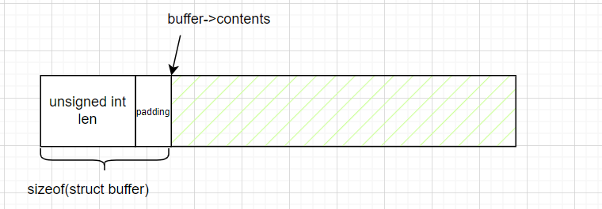
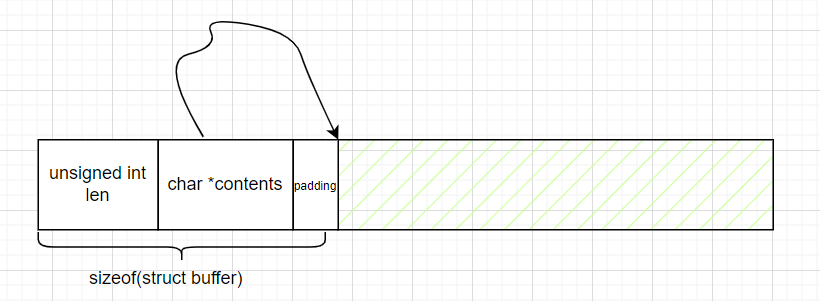

[toc]

## 摘要

本文先介绍柔性数组成员(flexible array member)的基本使用，然后介绍其内存结构。最后，补充了一些数组相关的其他概念。

---

## 柔性数组成员

### 基本使用

参考: [【C语言内功修炼】柔性数组的奥秘\_数组\_Albert Edison\_InfoQ写作社区](https://xie.infoq.cn/article/6f1da2c291b1fb5f361dcb87d)

C99之后，可以使用 *flexible array member*。它大概长下面这个样子。

```c
struct buffer {
  unsigned int len;
  char contents[]; // flexible array member
};
```

- *flexible array member* 可以认为是零长度数组实现的一个特例(下文会介绍零长度数组)。`sizeof(buffer.contents)`的值为0。
- *flexible array member* **只能作为结构体的最后一个成员**。

下面我们看一个demo，来体验下 *flexible array member* 带来的便利。

这个demo比较简单。分配一个缓冲区，往里面写内容。这个缓冲区保有缓冲区的大小。

```c
// demo-1.c
#include <stdio.h>
#include <stdlib.h>

struct buffer {
  unsigned int len;
  char contents[];
};

int main(int argc, char *argv[]) {
  unsigned int buf_len = 100;

  // construct a buffer
  struct buffer *buffer =
      malloc(sizeof(struct buffer) + buf_len * (sizeof(char)));
  buffer->len = buf_len;

  snprintf(buffer->contents, buffer->len, "%s", "hello world");
  printf("%s\n", buffer->contents);

  free(buffer);
  return 0;
}
```

如果不使用柔性数组，下面这样，可以实现同样的功能。而且也非常简单。

```c
//demo-2.c
#include <stdio.h>
#include <stdlib.h>

struct buffer {
  unsigned int len;
  char *contents;
};

int main(int argc, char *argv[]) {
  unsigned int buf_len = 100;

  // construct a buffer
  struct buffer *buffer =
      malloc(sizeof(struct buffer) + buf_len * (sizeof(char)));
  buffer->contents = (char *)buffer + sizeof(struct buffer);
  buffer->len = buf_len;

  snprintf(buffer->contents, buffer->len, "%s", "hello world");
  printf("%s\n", buffer->contents);

  free(buffer);
  return 0;
}
```

这两者有什么区别呢？下一节我们来探究下。

---

### 细节探究

参考：[Zero Length (Using the GNU Compiler Collection (GCC))](https://gcc.gnu.org/onlinedocs/gcc/Zero-Length.html)

首先，上面demo中，`struct buffer`的大小是不同的。我这里直接给出大小。这个大小可以通过打印或者gdb方式获取。

```c
// 当前环境
Linux da1234cao 5.15.133.1-microsoft-standard-WSL2 x86_64 GNU/Linux

// demo-2中buffer结构体
// sizeof(struct buffer) == 16 ; sizeof(char*) == 8
struct buffer {
  unsigned int len;
  char *contents;
};

// demo-1中buffer结构体
// sizeof(struct buffer) == 4 ; sizeof(buffer.contents) == 0
struct buffer {
  unsigned int len;
  char contents[];
};

// 修改下flexible array member的类型
// sizeof(struct buffer) == 8 ; sizeof(buffer.contents) == 0
struct buffer {
  unsigned int len;
  long contents[];
};
```

**可以看到 *flexible array member* 的空间大小为0**。但由于尾部填充，*flexible array member* 可能会导致结构体的空间变大，其空间对齐方式，与 *flexible array member* 的类型相同。我们知道指针是可以进行加法运算的，同样，它的偏移量由 *flexible array member* 的类型决定。

此时，我们来绘制下包含 *flexible array member* 结构体的内存结构。



而上面demo-2.c中的结构体内存则是这样。



最后，我不建议将一个包含 *flexible array member* 的结构体，嵌套到其他结构体中，虽然这样做是允许的。如果你想这么做的话，请自行参考官方手册。我没太看懂这块。

**Tips**: 如果结构体中包含 *flexible array member* , 可以放心的将结构体进行memset操作。*flexible array member* 总是指向后面的位置。

---

## 零长度数组-定长数组-变长数组

通过上一节，我们已经掌握了 *flexible array member* 的使用。这里补充些其他相关的基本概念。

**零长度数组**。

可以认为 *flexible array member* 是零长度数组的一种实现。 *flexible array member* 是在C99之后出现的。在C99之前，程序员们这样使用零长度数组。

```c
struct line {
  int length;
  char contents[0]; // [] 中多了一个0
};
```

上面的代码和 *flexible array member* 效果相同。但是，在C99之后，请使用 *flexible array member* 。按照手册写代码，我不知道有没有什么原因或者好处。

**定长数组**。

在C99之前，数组在创建的时候，必须给定一个常量。这个数组长度在编译的时候，已经确定。

```c
// 定长数组
char array[10];

// 下面这个也是定长数组
// 可以参考下 《C语言程序设计 -- 现代方法》8.1.2 数组初始化
// 如果给定了初始化式，可以省略掉数组的长度; 编译器利用初始化式的长度来确定数组的大小。数组仍然有固定数量的元素;
char array[] = {'a', 'b', 'c'};
```

**变长数组**。

参考： [Variable Length (Using the GNU Compiler Collection (GCC))](https://gcc.gnu.org/onlinedocs/gcc/Variable-Length.html)

数组长度在运行时确定。

```c
int n = 10;
char array[n];
```