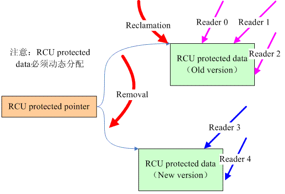

# DPDK-RCU的简明使用

## 摘要

本文主要介绍DPDK中[RCU Library](https://doc.dpdk.org/guides/prog_guide/rcu_lib.html)的使用。

在使用这个库之前，我们先去了解RCU的基本概念。

掌握RCU的基本概念后，便可轻松的使用这个库。

## RCU的基本概念

参考：[Linux内核同步机制之（七）：RCU基础](http://www.wowotech.net/kernel_synchronization/rcu_fundamentals.html)、 [What is RCU? -- "Read, Copy, Update" — The Linux Kernel documentation](https://www.kernel.org/doc/html/next/RCU/whatisRCU.html)

上面两篇文档交叉着看下，基本能明白RCU的概念。(~~我英语比较烂，读英文隔着点意思，我更喜欢中文文档~~

**下面内容，来自上面链接**。

每个工具，都有最佳的适应场景。RCU主要适应如下场景：(1)RCU只能保护动态分配的数据结构，并且必须是通过指针访问该数据结构。(2)受RCU保护的临界区内不能阻塞。(3)读写不对称，对writer的性能没有特别要求，但是reader性能要求极高。(4)reader端对新旧数据不敏感。

我们再来看下RCU的基本思路。



上图可以看到RCU中核心的两部：removal 和 reclamation。

removal：(1)读取线程一直读，没有任何锁。(2)当写线程需要修改这块内容时，它先拷贝下这块内容到新的内存，然后在新的内存中进行修改。此时读取线程，读取的任然是旧的未修改的内容。(3) 原子操作，使用新内存地址，替换旧的内存地址。此时，原来在读取旧内存的线程，继续读旧内存中的数据；后来的读取线程，将读新内存的数据。

reclamation：待读取旧内存的线程，都离开这段区域后，写线程回收释放掉旧内存。

理解RCU的基本概念后，我们再看下RCU的API，可以抽象成下面两部分：

读取线程使用的RCU API:
* rcu_read_lock，用来标识临界区的开始
* rcu_dereference, 用来获取RCU保护数据的指针
* rcu_read_unlock，用来标识离开临界区

写线程使用的RCU API:
* rcu_assign_pointer, 使用新版本的内存的指针，替换旧版本的指针。
* synchronize_rcu, 等待读取旧版本的线程，都离开，这会造成写线程阻塞。
* call_rcu, 异步操作，当读取旧版本的线程都离开临界区后，自动调用回调函数，回调函数中回收旧版本的资源

明白上面内容后，我们即掌握了RCU的基本概念。这里再补充几个RCU相关的术语，以便沟通。

Quiescent State: 当前CPU对应的线程，离开了这块不同线程共享的内存。(这描述的是当前这点的状态，而不是时间段)

grace period: 在将旧版本的内存指针，替换成新版本的数据之后，到允许将旧版本的内容回收，这段时间。(这要求读取旧版本数据的线程，都到达一次Quiescent State)

## DPDK RCU Library的使用

参考：[RCU Library](https://doc.dpdk.org/guides/prog_guide/rcu_lib.html)、 [DPDK: lib/rcu/rte\_rcu\_qsbr.h File Reference](https://doc.dpdk.org/api/rte__rcu__qsbr_8h.html)、 [test_rcu_qsbr.c](https://github.com/DPDK/dpdk/blob/v23.11/app/test/test_rcu_qsbr.c)

这节提供了一个demo，这个demo模拟这样的场景：DPDK在高速的转发数据中; 然后允许通过信号动态的修改配置。(这里很使用使用RCU，对reader的性能要求极高，对writer的性能没啥要求)

首先是初始化：`rte_rcu_qsbr_get_memsize()`、`rte_rcu_qsbr_init()`。

读取线程：
* reader线程, 注册,用来将来报告quiescent state: `rte_rcu_qsbr_thread_register()`
* reader线程，进入临界区时调用：`rte_rcu_qsbr_thread_online()`
* reader线程，离开临界区时调用：`rte_rcu_qsbr_thread_offline()`
* reader线程，离开临界区之前，更新下自己的quiescent state: `rte_rcu_qsbr_quiescent()`

写线程：
* writer线程，阻塞grace period时间，然后便可回收资源：`rte_rcu_qsbr_synchronize`
* writer线程，如果不想阻塞，可以将待回收的资源放入队列中自动回收：`rte_rcu_qsbr_dq_enqueue`

上面这些API都是用户层面的。它的源码值得一读，以观RCU的一种实现。(我没看它的源码目前)

```c
#include <signal.h>
#include <stdatomic.h>

#include <rte_common.h>
#include <rte_eal.h>
#include <rte_errno.h>
#include <rte_log.h>
#include <rte_malloc.h>
#include <rte_memcpy.h>
#include <rte_rcu_qsbr.h>
#include <rte_thread.h>

#define RTE_LOGTYPE_RCU_TEST RTE_LOGTYPE_USER1
#define CONFIG_SIZE 100

struct rte_rcu_qsbr *rcu = NULL;
char *global_config = NULL;

void signal_handle(int signum) {
  if (signum == SIGTERM) {
    exit(0);
  } else if (signum == SIGHUP) {
    char *new_config = rte_zmalloc(NULL, CONFIG_SIZE, 0);
    if (strcmp(global_config, "enable") == 0) {
      snprintf(new_config, CONFIG_SIZE, "%s", "disable");
    } else {
      snprintf(new_config, CONFIG_SIZE, "%s", "enable");
    }

    // 使用新的内存地址，替换旧的内存地址
    char *old_config = global_config;
    global_config = new_config;
    // __atomic_store(&global_config, &new_config, __ATOMIC_RELAXED);

    // 阻塞,知道所有reader在旧地址上的读取结束
    rte_rcu_qsbr_synchronize(rcu, RTE_QSBR_THRID_INVALID);

    // 释放旧内存
    rte_free(old_config);
  } else {
    RTE_LOG(DEBUG, RCU_TEST, "unsolve signal: %d\n", signum);
  }
}

uint32_t loop(void *arg) {

  // can not lcore id
  // unsigned int lcore_id = rte_lcore_id();

  unsigned int lcore_id = *(int *)arg;

  RTE_LOG(DEBUG, RCU_TEST, "start thread %u\n", lcore_id);

  rte_rcu_qsbr_thread_register(rcu, lcore_id);

  while (1) {
    rte_rcu_qsbr_thread_online(rcu, lcore_id);
    RTE_LOG(DEBUG, RCU_TEST, "curret config: %s\n", global_config);
    rte_rcu_qsbr_quiescent(rcu, lcore_id);
    rte_rcu_qsbr_thread_offline(rcu, lcore_id);
  }

  return 0;
}

int main(int argc, char *argv[]) {

  rte_log_set_level(RTE_LOGTYPE_RCU_TEST, RTE_LOG_DEBUG);
  RTE_LOG(DEBUG, RCU_TEST, "%s\n", "start dpdk_rcu_test...");

  if (rte_eal_init(argc, argv) < 0) {
    RTE_LOG(ERR, RCU_TEST, "%s\n", rte_strerror(rte_errno));
    exit(-1);
  }

  size_t size = rte_rcu_qsbr_get_memsize(RTE_MAX_LCORE);
  rcu = rte_zmalloc(NULL, size, 0);
  rte_rcu_qsbr_init(rcu, RTE_MAX_LCORE);

  global_config = rte_zmalloc(NULL, CONFIG_SIZE, 0);
  if (global_config == NULL) {
    RTE_LOG(ERR, RCU_TEST, "%s\n", "no enough space");
    exit(-1);
  }

  char status[] = "enable";
  rte_memcpy(global_config, status, sizeof(status));

  // 注册信号处理函数
  struct sigaction action;
  action.sa_handler = signal_handle;
  action.sa_flags = SA_RESTART;
  sigfillset(&action.sa_mask);
  sigaction(SIGTERM, &action, NULL);
  sigaction(SIGHUP, &action, NULL);

  // 创建多个reader线程
  unsigned int lcore_cnt = rte_lcore_count();
  rte_thread_t thread_ids[lcore_cnt];
  for (unsigned int i = 0; i < lcore_cnt; i++) {
    rte_thread_create(&thread_ids[i], NULL, loop, &i);
  }

  // 避免进程退出
  for (unsigned int i = 0; i < lcore_cnt; i++) {
    rte_thread_join(thread_ids[i], NULL);
  }

  rte_free(global_config);
}
```

## 其他

第一个问题是，上面，使用新内存指针，替换旧内存指针时，需不需要使用atomic来确保原子操作。

```c
global_config = new_config;
// __atomic_store(&global_config, &new_config, __ATOMIC_RELAXED);
```

直觉是不需要的。如果需要的话，RCU API文档中一定会说明的。另外我们可以验证下上面的赋值操作是否为原子操作。我们通过gdb查看它对应的汇编代码。

```asm
32          global_config = new_config;
   0x000000000005b009 <+185>:   mov    -0x10(%rbp),%rax
   0x000000000005b00d <+189>:   mov    %rax,0x5413ffc(%rip)        # 0x546f010 <global_config>
```

可以看到赋值操作，不是一个原子操作，分为两步：将new_config的值加载到rax寄存器中，然后修改global_config的值。但是修改global_config的值是原子操作。(一般情况下，一条汇编对应一个机器指令，但也不一定：[cpu architecture - Do assembly instructions map 1-1 to machine language? - Stack Overflow](https://stackoverflow.com/questions/57315016/do-assembly-instructions-map-1-1-to-machine-language))

所以，直接赋值修改就行了。不是加加减减的操作，这里赋值用不着进行原子操作。

另外，上面示例中使用了信号。信号还是一个挺麻烦的东西，它的使用可见：[Linux上信号的使用\_linux 设置信号-CSDN博客](https://blog.csdn.net/sinat_38816924/article/details/131646236)

