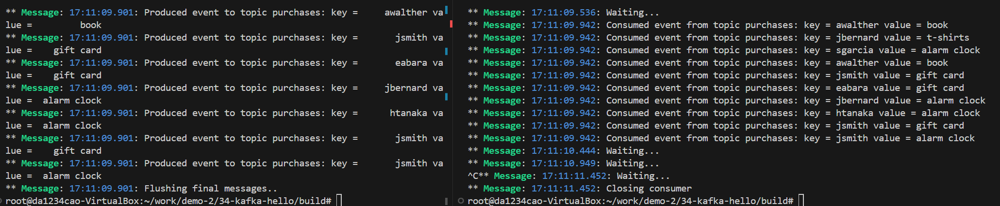

[toc]

## 摘要

本文是[Getting Started with Apache Kafka and C/C++](https://developer.confluent.io/get-started/c/)的中文版， kafka的hello world程序。

## kafka是什么

本节来源：[Kafka - 维基百科，自由的百科全书](https://zh.wikipedia.org/wiki/Kafka)、[Kafka入门简介 - 知乎](https://zhuanlan.zhihu.com/p/31731892)

首先我们得知道什么是Kafka。

Kafka是一个分布式流处理系统，流处理系统使它可以像消息队列一样publish或者subscribe消息，分布式提供了容错性，并发处理消息的机制。


kafka有以下一些基本概念：

* Producer - 消息生产者，就是向kafka broker发消息的客户端。
* Consumer - 消息消费者，是消息的使用方，负责消费Kafka服务器上的消息。
* Topic - 主题，由用户定义并配置在Kafka服务器，用于建立Producer和Consumer之间的订阅关系。生产者发送消息到指定的Topic下，消息者从这个Topic下消费消息。
* Partition - 消息分区，一个topic可以分为多个 partition，每个partition是一个有序的队列。partition中的每条消息都会被分配一个有序的id（offset）。
* Broker - 一台kafka服务器就是一个broker。一个集群由多个broker组成。一个broker可以容纳多个topic。
* Consumer Group - 消费者分组，用于归组同类消费者。每个consumer属于一个特定的consumer group，多个消费者可以共同消费一个Topic下的消息，每个消费者消费其中的部分消息，这些消费者就组成了一个分组，拥有同一个分组名称，通常也被称为消费者集群。
* Offset - 消息在partition中的偏移量。每一条消息在partition都有唯一的偏移量，消费者可以指定偏移量来指定要消费的消息。


## 安装环境

上一节，kafka的概念看着比较简单，发布-订阅/生产-消费的模型。

为了可以调用Kafka的C/C++ API, 需要先安装环境。

```shell
# almlinux8
# dnf search kafka
# dnf install librdkafka-devel

# dnf search glib
# dnf install glib2-devel

# ubuntu22
# 开发库
➜ apt install librdkafka-dev  libglib2.0-dev

# 安装docker环境
➜ apt install docker.io docker-compose

# 本地安装 Kafka
## ref: https://docs.confluent.io/confluent-cli/current/install.html#cp
➜ wget -qO - https://packages.confluent.io/confluent-cli/deb/archive.key | sudo apt-key add
➜ add-apt-repository "deb https://packages.confluent.io/confluent-cli/deb stable main"
➜ apt install confluent-cli

## 启动kafka
## usage: https://docs.confluent.io/confluent-cli/current/command-reference/local/kafka/confluent_local_kafka_start.html
## error: https://stackoverflow.com/questions/63776518/error-2-matches-found-based-on-name-network-nameofservice-default-is-ambiguo
## error:https://stackoverflow.com/questions/77985757/kafka-in-docker-using-confluent-cli-doesnt-work

➜ whereis confluent
confluent: /usr/bin/confluent

➜ export CONFLUENT_HOME=/usr/bin/confluent

# 我执行下面命令后,没有看到Plaintext Ports信息
➜ confluent local kafka start

# 停止，然后重新启动，管用了
➜ confluent local kafka stop
➜ confluent local kafka start

The local commands are intended for a single-node development environment only, NOT for production usage. See more: https://docs.confluent.io/current/cli/index.html


Pulling from confluentinc/confluent-local
Digest: sha256:ad62269bf4766820c298f7581cf872a49f46a11dbaebcccb4fd2e71049288c5b
Status: Image is up to date for confluentinc/confluent-local:7.6.0
+-----------------+-------+
| Kafka REST Port | 8082  |
| Plaintext Ports | 43465 |
+-----------------+-------+
Started Confluent Local containers "8d72d911a4".
To continue your Confluent Local experience, run `confluent local kafka topic create <topic>` and `confluent local kafka topic produce <topic>`.

# Create a new topic, purchases, which you will use to produce and consume events.
➜ confluent local kafka topic create purchases
Created topic "purchases".
```

## librdkafka的简单使用

[confluenceinc/librdkafka](https://github.com/confluentinc/librdkafka?tab=readme-ov-file)是Apache Kafka协议的 C 库实现 ，提供生产者、消费者和管理客户端。

下面运行的程序来自：[Apache Kafka and C/C++ - Getting Started Tutorial](https://developer.confluent.io/get-started/c/#introduction)

代码中kafka的API可以查询：[librdkafka: librdkafka documentation](https://docs.confluent.io/platform/7.5/clients/librdkafka/html/index.html)

代码中使用了glib库，日常开发我不会使用这个库，因为感觉比较冷，它的API可查询：[GLib – 2.0: Automatic Cleanup](https://docs.gtk.org/glib/auto-cleanup.html)

完整代码见仓库，这里只列出producer/consumer的代码

### 生产者

总体逻辑：
* 从配置文件中加载配置
* 创建生产者
* 生产者发送消息

```c
#include <glib.h>
#include <librdkafka/rdkafka.h>

#include "common.c"

#define ARR_SIZE(arr) ( sizeof((arr)) / sizeof((arr[0])) )

/* Optional per-message delivery callback (triggered by poll() or flush())
 * when a message has been successfully delivered or permanently
 * failed delivery (after retries).
 */
static void dr_msg_cb (rd_kafka_t *kafka_handle,
                       const rd_kafka_message_t *rkmessage,
                       void *opaque) {
    if (rkmessage->err) {
        g_error("Message delivery failed: %s", rd_kafka_err2str(rkmessage->err));
    }
}

int main (int argc, char **argv) {
    rd_kafka_t *producer;
    rd_kafka_conf_t *conf;
    char errstr[512];

    // Parse the command line.
    if (argc != 2) {
        g_error("Usage: %s <config.ini>", argv[0]);
        return 1;
    }

    // Parse the configuration.
    // See https://github.com/edenhill/librdkafka/blob/master/CONFIGURATION.md
    const char *config_file = argv[1];

    g_autoptr(GError) error = NULL;
    g_autoptr(GKeyFile) key_file = g_key_file_new();
    if (!g_key_file_load_from_file (key_file, config_file, G_KEY_FILE_NONE, &error)) {
        g_error ("Error loading config file: %s", error->message);
        return 1;
    }

    // Load the relevant configuration sections.
    conf = rd_kafka_conf_new();
    load_config_group(conf, key_file, "default");

    // Install a delivery-error callback.
    rd_kafka_conf_set_dr_msg_cb(conf, dr_msg_cb);

    // Create the Producer instance.
    producer = rd_kafka_new(RD_KAFKA_PRODUCER, conf, errstr, sizeof(errstr));
    if (!producer) {
        g_error("Failed to create new producer: %s", errstr);
        return 1;
    }

    // Configuration object is now owned, and freed, by the rd_kafka_t instance.
    conf = NULL;

    // Produce data by selecting random values from these lists.
    int message_count = 10;
    const char *topic = "purchases";
    const char *user_ids[6] = {"eabara", "jsmith", "sgarcia", "jbernard", "htanaka", "awalther"};
    const char *products[5] = {"book", "alarm clock", "t-shirts", "gift card", "batteries"};

    for (int i = 0; i < message_count; i++) {
        const char *key =  user_ids[random() % ARR_SIZE(user_ids)];
        const char *value =  products[random() % ARR_SIZE(products)];
        size_t key_len = strlen(key);
        size_t value_len = strlen(value);

        rd_kafka_resp_err_t err;

        err = rd_kafka_producev(producer,
                                RD_KAFKA_V_TOPIC(topic),
                                RD_KAFKA_V_MSGFLAGS(RD_KAFKA_MSG_F_COPY),
                                RD_KAFKA_V_KEY((void*)key, key_len),
                                RD_KAFKA_V_VALUE((void*)value, value_len),
                                RD_KAFKA_V_OPAQUE(NULL),
                                RD_KAFKA_V_END);

        if (err) {
            g_error("Failed to produce to topic %s: %s", topic, rd_kafka_err2str(err));
            return 1;
        } else {
            g_message("Produced event to topic %s: key = %12s value = %12s", topic, key, value);
        }

        rd_kafka_poll(producer, 0);
    }

    // Block until the messages are all sent.
    g_message("Flushing final messages..");
    rd_kafka_flush(producer, 10 * 1000);

    if (rd_kafka_outq_len(producer) > 0) {
        g_error("%d message(s) were not delivered", rd_kafka_outq_len(producer));
    }

    g_message("%d events were produced to topic %s.", message_count, topic);

    rd_kafka_destroy(producer);

    return 0;
}
```


### 消费者

总体逻辑：
* 从配置文件中加载配置
* 创建消费者
* 订阅topic
* 轮询消费者的消息

```c
#include <glib.h>
#include <librdkafka/rdkafka.h>

#include "common.c"

static volatile sig_atomic_t run = 1;

/**
 * @brief Signal termination of program
 */
static void stop(int sig) { run = 0; }

int main(int argc, char **argv) {
  rd_kafka_t *consumer;
  rd_kafka_conf_t *conf;
  rd_kafka_resp_err_t err;
  char errstr[512];

  // Parse the command line.
  if (argc != 2) {
    g_error("Usage: %s <config.ini>", argv[0]);
    return 1;
  }

  // Parse the configuration.
  // See https://github.com/edenhill/librdkafka/blob/master/CONFIGURATION.md
  const char *config_file = argv[1];

  g_autoptr(GError) error = NULL;
  g_autoptr(GKeyFile) key_file = g_key_file_new();
  if (!g_key_file_load_from_file(key_file, config_file, G_KEY_FILE_NONE,
                                 &error)) {
    g_error("Error loading config file: %s", error->message);
    return 1;
  }

  // Load the relevant configuration sections.
  conf = rd_kafka_conf_new();
  load_config_group(conf, key_file, "default");
  load_config_group(conf, key_file, "consumer");

  // Create the Consumer instance.
  consumer = rd_kafka_new(RD_KAFKA_CONSUMER, conf, errstr, sizeof(errstr));
  if (!consumer) {
    g_error("Failed to create new consumer: %s", errstr);
    return 1;
  }
  rd_kafka_poll_set_consumer(consumer);

  // Configuration object is now owned, and freed, by the rd_kafka_t instance.
  conf = NULL;

  // Convert the list of topics to a format suitable for librdkafka.
  const char *topic = "purchases";
  rd_kafka_topic_partition_list_t *subscription =
      rd_kafka_topic_partition_list_new(1);
  rd_kafka_topic_partition_list_add(subscription, topic, RD_KAFKA_PARTITION_UA);

  // Subscribe to the list of topics.
  err = rd_kafka_subscribe(consumer, subscription);
  if (err) {
    g_error("Failed to subscribe to %d topics: %s", subscription->cnt,
            rd_kafka_err2str(err));
    rd_kafka_topic_partition_list_destroy(subscription);
    rd_kafka_destroy(consumer);
    return 1;
  }

  rd_kafka_topic_partition_list_destroy(subscription);

  // Install a signal handler for clean shutdown.
  signal(SIGINT, stop);

  // Start polling for messages.
  while (run) {
    rd_kafka_message_t *consumer_message;

    consumer_message = rd_kafka_consumer_poll(consumer, 500);
    if (!consumer_message) {
      g_message("Waiting...");
      continue;
    }

    if (consumer_message->err) {
      if (consumer_message->err == RD_KAFKA_RESP_ERR__PARTITION_EOF) {
        /* We can ignore this error - it just means we've read
         * everything and are waiting for more data.
         */
      } else {
        g_message("Consumer error: %s",
                  rd_kafka_message_errstr(consumer_message));
        return 1;
      }
    } else {
      g_message("Consumed event from topic %s: key = %.*s value = %s",
                rd_kafka_topic_name(consumer_message->rkt),
                (int)consumer_message->key_len, (char *)consumer_message->key,
                (char *)consumer_message->payload);
    }

    // Free the message when we're done.
    rd_kafka_message_destroy(consumer_message);
  }

  // Close the consumer: commit final offsets and leave the group.
  g_message("Closing consumer");
  rd_kafka_consumer_close(consumer);

  // Destroy the consumer.
  rd_kafka_destroy(consumer);

  return 0;
}
```

### 运行输出如下

生产者发送消息-消费者消费消息。

