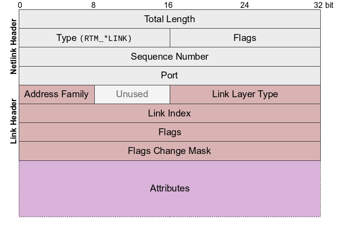
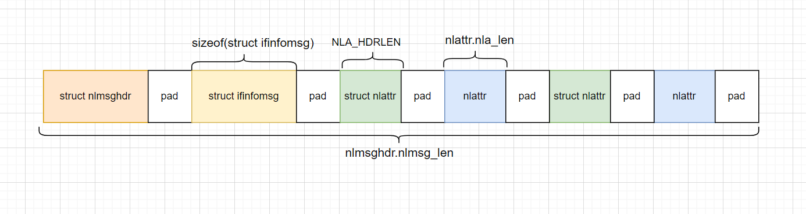

[toc]

# libnl教程(2):发送请求

## 前言

前置阅读要求：[libnl教程(1):订阅内核的netlink广播通知](https://blog.csdn.net/sinat_38816924/article/details/141170402)

本文介绍，libnl如何向内核发送请求。这包含三个部分：构建请求；创建套接字；发送请求。

同样，本文使用示例说明libnl的API该如何组合使用。

本文使用的示例是，发送netlink请求，以创建一张dummy网卡。

---

## 示例

### 示例代码

运行该示例代码，即可创建一个`dummy`类型的网卡。网卡名为`dummy0`。

代码参考自：https://github.com/FDio/vpp/blob/master/src/vnet/devices/netlink.c

上面的参考代码很好，完整的显示了构建请求-创建套接字-发送请求-接收回复的过程。

但是上面参考代码的路子有点野。因为它很少调用libnl的API。它作为参考是好的。但是日常编程中，还是尽量调用libnl的API。

下面的示例代码中，我在展示逻辑结构的基础上，尽量调用了libnl的API。

```c
#include <linux/rtnetlink.h>
#include <netlink/msg.h>
#include <netlink/netlink.h>
#include <netlink/route/link.h>
#include <netlink/socket.h>

int netlink_add(const char *iftype, const char *ifname) {
  int ret = 0;
  struct nl_msg *msg = NULL;
  struct nl_sock *sk = NULL;

  // 构建请求
  msg = nlmsg_alloc_simple(RTM_NEWLINK, NLM_F_REQUEST | NLM_F_ACK |
                                            NLM_F_CREATE | NLM_F_EXCL);

  struct ifinfomsg ifi = {};
  ifi.ifi_family = AF_UNSPEC;

  ret = nlmsg_append(msg, &ifi, sizeof(ifi), NLMSG_ALIGNTO);
  if (ret < 0) {
    printf("%s", nl_geterror(ret));
    goto end;
  }

#if 0
  ret = nla_put_string(msg, IFLA_INFO_KIND, iftype);
  if (ret < 0) {
    goto end;
  }
#endif

  struct nlattr *info = nla_nest_start(msg, IFLA_LINKINFO);
  ret = nla_put_string(msg, IFLA_INFO_KIND, iftype);
  if (ret < 0) {
    printf("%s", nl_geterror(ret));
    goto end;
  }
  nla_nest_end(msg, info);

  ret = nla_put_string(msg, IFLA_IFNAME, ifname);
  if (ret < 0) {
    printf("%s", nl_geterror(ret));
    goto end;
  }

  // 创建套接字
  sk = nl_socket_alloc();

  nl_connect(sk, NETLINK_ROUTE);

  // 发送请求
  ret = nl_send_auto(sk, msg);
  if (ret < 0) {
    printf("%s", nl_geterror(ret));
    goto end;
  }

  // 接收回复
  ret = nl_recvmsgs_default(sk);
  if (ret < 0) {
    printf("%s", nl_geterror(ret));
    goto end;
  }

end:
  nlmsg_free(msg);
  nl_socket_free(sk);
  return 0;
}

int main(int argc, char *argv[]) { netlink_add("dummy", "dummy0"); }
```

### 构造请求

一个Link请求包含三部分：
- netlink header(struct nlmsghdr): netlink消息本身的头。其余部分都是netlink消息的负载。整个消息都遵循TLV([Type–length–value](https://en.wikipedia.org/wiki/Type%E2%80%93length%E2%80%93value))。消息头中记录着消息的整体长度。后面的负载中的属性也遵循TLV。
- netlink link messages header(struct ifinfomsg): Link请求的消息头。
- netlink attributes(struct nlattr): 一个属性的类型和长度，后面要跟着具体的属性。

请求的整体格式如下。



在内存中，有对齐要求，格式如下。



接下来介绍，该如何填充这些内容。

- struct nlmsghdr的填充：可以使用 `nlmsg_alloc_simple(int nlmsg_type, int flags)`函数填充。调用这些API的好处是，可以屏蔽 sequence numbers、port等细节。代码中的消息类型是`RTM_NEWLINK`表示创建网卡。标志的含义表示，这是一个请求，需要回复，请求创建一张网卡，如果网卡已经存在，则不在创建。
- struct ifinfomsg的填充：示例代码没有填充任何内容。因为是创建网卡。如果是查询/修改网卡等操作，需要根据不同情况填充不同内容。
- struct nlattr的填充：示例追加了两个属性，分别用来设置网卡类型和网卡名称。为什么网卡类型使用嵌套属性。因为我们用户层是发起请求，这个是内核路由部分的要求。我是咋知道的呢？因为我去看来libnl中`rtnl_link_add()`函数的源码知道的。

### 创建套接字

使用libnl的接口创建套接字。当然，我们也可以跳过libnl的API，直接使用socket创建套接字，但是没必要。

```c
sk = nl_socket_alloc();
nl_connect(sk, NETLINK_ROUTE);
```

### 发送请求

通过netlink套接字，发送netlink消息的标准方法是，使用`nl_send_auto()`函数。它将自动补充netlink消息头中丢失的内容信息，然后将消息传递给`nl_send()`。

## 简化示例

上面示例中，最麻烦的一步是构造请求。

其实，我们想一想，构造请求基本都是固定的，只有很少的字段需要用户指定。

再想一想，其实请求和回复也基本是固定的。

这些都可以按照目的进行封装，形成更高层的接口。

下面，我们使用libnl的接口，可以更简单的实现我们的目标。(因为这个完全失去了请求的细节，所以我构造了上面的示例。)

```c
#include <linux/rtnetlink.h>
#include <netlink/msg.h>
#include <netlink/netlink.h>
#include <netlink/route/link.h>
#include <netlink/socket.h>

int netlink_add(const char *iftype, const char *ifname) {
  struct rtnl_link *link = rtnl_link_alloc();
  rtnl_link_set_type(link, iftype);
  rtnl_link_set_name(link, ifname);

  struct nl_sock *sk = nl_socket_alloc();
  nl_connect(sk, NETLINK_ROUTE);

  rtnl_link_add(sk, link, NLM_F_CREATE | NLM_F_EXCL);
  return 0;
}

int main(int argc, char *argv[]) { netlink_add("dummy", "dummy0"); }
```