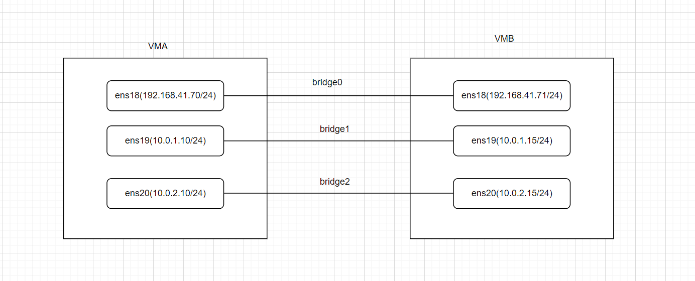

[toc]

# ebpf教程(4.1):加载XDP程序

## 前言

前置阅读要求：
- [ebpf教程(3):使用cmake构建ebpf项目-CSDN博客](https://da1234cao.blog.csdn.net/article/details/141265214)
- [[译] [论文] XDP (eXpress Data Path)：在操作系统内核中实现快速、可编程包处理（ACM，2018）](https://arthurchiao.art/blog/xdp-paper-acm-2018-zh/)
- [xdp-tools/lib/libxdp/README.org at master · xdp-project/xdp-tools](https://github.com/xdp-project/xdp-tools/blob/master/lib/libxdp/README.org)

在阅读完上面的文档后，我们大概知道XDP（eXpress Data Path）允许在数据包进入内核协议栈之前进行处理，这减少了不必要的开销。由于处理发生在内核的早期阶段，XDP 能够显著提高网络处理性能，特别是对于高流量的场景。

本文是XDP的hello world -- 加载XDP程序。

---

## 环境准备

```shell
# 安装依赖
apt install libxdp-dev xdp-tools

# 当前的libxdp版本
pkg-config --modversion libxdp
1.4.2

# 当前的内核版本(ubuntu24的内核)
uname -r
6.8.0-31-generic
```

我当前的网络拓扑如下图所示。当然本文的示例对网络拓扑没有要求，把程序加载到网卡上即可。



---

## 加载XDP程序

---

### 源码

下面的示例代码修改自：
- [xdp-tutorial/basic01-xdp-pass/README.org at master · xdp-project/xdp-tutorial](https://github.com/xdp-project/xdp-tutorial/blob/master/basic01-xdp-pass/README.org)
- [xdp-tutorial/basic02-prog-by-name/README.org at master · xdp-project/xdp-tutorial](https://github.com/xdp-project/xdp-tutorial/blob/master/basic02-prog-by-name/README.org)

bpf程序的生命周期：open--create--attach--detach。

本文的 BPF ELF 文件中有两个XDP程序，可以选择按照名称加载。

首先是XDP程序。两个程序，分别是放行或者阻止数据包。

```c
// xdp_kernel_prog.c
#include <linux/types.h>

#include <bpf/bpf_helpers.h>
#include <linux/bpf.h>

SEC("xdp")
int xdp_pass_func(struct xdp_md *ctx) {
  bpf_printk("%s", "Pkt pass...");
  return XDP_PASS;
}

SEC("xdp")
int xdp_drop_func(struct xdp_md *ctx) {
  bpf_printk("%s", "Pkt drop...");
  return XDP_DROP;
}

char _license[] SEC("license") = "GPL";
```

下面是加载XDP程序的用户层程序。

示例代码中，我使用了argp库，我喜欢用这个库来处理命令行参数。它的使用可见：[一步步了解Argp-CSDN博客](https://da1234cao.blog.csdn.net/article/details/122180938)

```c
#include <argp.h>
#include <net/if.h>
#include <signal.h>
#include <stdio.h>
#include <stdlib.h>
#include <unistd.h>

#include <bpf/libbpf.h>
#include <xdp/libxdp.h>

#define PROG_NAME_MAXSIZE 32

static char ifname[IF_NAMESIZE] = {};
static const char *filename = "xdp_kernel_prog.o";
static char prog_name[PROG_NAME_MAXSIZE] = {};
static volatile bool exiting = false;

static int parse_opt(int key, char *arg, struct argp_state *state) {
  switch (key) {
  case 'd':
    snprintf(ifname, sizeof(ifname), "%s", arg);
    break;
  case 'p':
    snprintf(prog_name, sizeof(prog_name), "%s", arg);
    break;
  }
  return 0;
}

static void sig_handler(int sig) { exiting = true; }

int main(int argc, char *argv[]) {
  int ret = 0;
  struct bpf_object *obj;

  struct argp_option options[] = {
      {"dev", 'd', "DEV NAME", 0, "set the network card name"},
      {"prog", 'p', "program name", 0, "set the program"},
      {0},
  };

  struct argp argp = {
      .options = options,
      .parser = parse_opt,
  };

  argp_parse(&argp, argc, argv, 0, 0, 0);

  // check parameter
  printf("choice dev: %s\n", ifname);
  int ifindex = if_nametoindex(ifname);
  if (ifindex == 0) {
    perror("if_nametoindex failed");
    exit(EXIT_FAILURE);
  }
  printf("%s's index %d\n", ifname, ifindex);

  /* Cleaner handling of Ctrl-C */
  signal(SIGINT, sig_handler);
  signal(SIGTERM, sig_handler);

  obj = bpf_object__open(filename);
  if (obj == NULL) {
    perror("bpf_object__open failed");
    exit(EXIT_FAILURE);
  }

  struct xdp_program_opts prog_opts = {};
  prog_opts.sz = sizeof(struct xdp_program_opts);
  prog_opts.obj = obj;
  prog_opts.prog_name = prog_name;

  struct xdp_program *prog = xdp_program__create(&prog_opts);
  if (prog == NULL) {
    perror("xdp_program__create failed.");
    exit(EXIT_FAILURE);
  }

  ret = xdp_program__attach(prog, ifindex, XDP_MODE_UNSPEC, 0);
  if (ret != 0) {
    perror("xdp_program__attach failed.");
    exit(EXIT_FAILURE);
  }

  while (!exiting) {
    sleep(1);
  }

cleanup:
  struct xdp_multiprog *mp = xdp_multiprog__get_from_ifindex(ifindex);
  ret = xdp_multiprog__detach(mp);
  if (ret != 0) {
    perror("xdp_multiprog__detach failed.");
    exit(EXIT_FAILURE);
  }

  bpf_object__close(obj);
}
```

---

### 构建过程

构建过程还是稍微有点麻烦了。CMake文件修改自：[libbpf-bootstrap/tools/cmake at master · libbpf/libbpf-bootstrap](https://github.com/libbpf/libbpf-bootstrap/tree/master/tools/cmake)

```cmake
cmake_minimum_required(VERSION 3.10)

project(xdp-load-prog)

find_package(PkgConfig)
pkg_check_modules(LIBBPF REQUIRED libbpf)
pkg_check_modules(LIBXDP REQUIRED libxdp)

# Get clang bpf system includes
execute_process(
  COMMAND bash -c "clang -v -E - < /dev/null 2>&1 |
          sed -n '/<...> search starts here:/,/End of search list./{ s| \\(/.*\\)|-idirafter \\1|p }'"
  OUTPUT_VARIABLE CLANG_SYSTEM_INCLUDES_output
  ERROR_VARIABLE CLANG_SYSTEM_INCLUDES_error
  RESULT_VARIABLE CLANG_SYSTEM_INCLUDES_result
  OUTPUT_STRIP_TRAILING_WHITESPACE)
if(${CLANG_SYSTEM_INCLUDES_result} EQUAL 0)
  separate_arguments(CLANG_SYSTEM_INCLUDES UNIX_COMMAND ${CLANG_SYSTEM_INCLUDES_output})
  message(STATUS "BPF system include flags: ${CLANG_SYSTEM_INCLUDES}")
else()
  message(FATAL_ERROR "Failed to determine BPF system includes: ${CLANG_SYSTEM_INCLUDES_error}")
endif()

set(BPF_C_FILE ${CMAKE_CURRENT_SOURCE_DIR}/xdp_kernel_prog.c)
set(BPF_O_FILE ${CMAKE_CURRENT_BINARY_DIR}/xdp_kernel_prog.o)
add_custom_command(OUTPUT ${BPF_O_FILE}
    COMMAND clang -g -O2 -target bpf ${CLANG_SYSTEM_INCLUDES} -c ${BPF_C_FILE} -o ${BPF_O_FILE}
    COMMAND_EXPAND_LISTS
    VERBATIM
    DEPENDS ${BPF_C_FILE}
    COMMENT "[clang] Building BPF file: ${BPF_C_FILE}")

add_custom_target(generate_bpf_obj ALL
    DEPENDS ${BPF_O_FILE}
)

add_executable(xdp_load xdp_loader.c)
target_link_libraries(xdp_load PRIVATE ${LIBBPF_LIBRARIES} ${LIBXDP_LIBRARIES})
```

---

### 运行

```shell
# 查看help信息
./xdp_load --help
Usage: xdp_load [OPTION...]

  -d, --dev=DEV NAME         set the network card name
  -p, --prog=program name    set the program
  -?, --help                 Give this help list
      --usage                Give a short usage message

Mandatory or optional arguments to long options are also mandatory or optional
for any corresponding short options.
```

放行指定网卡的所有数据包。

```shell
./xdp_load --dev=ens19 --prog=xdp_pass_func

# 查看是否附加成功
xdp-loader status ens19
CURRENT XDP PROGRAM STATUS:

Interface        Prio  Program name      Mode     ID   Tag               Chain actions
--------------------------------------------------------------------------------------
ens19                  xdp_dispatcher    native   403  4d7e87c0d30db711 
 =>              50     xdp_pass_func             412  2d69c152cb7a3b4b  XDP_PASS

# 向网卡发送数据后，查看trace信息
cat /sys/kernel/debug/tracing/trace_pipe
          <idle>-0       [004] ..s2. 24810.751471: bpf_trace_printk: Pkt pass...
          <idle>-0       [004] ..s2. 24811.768707: bpf_trace_printk: Pkt pass...
          <idle>-0       [004] ..s2. 24815.992664: bpf_trace_printk: Pkt pass...
```

丢弃指定网卡的所有数据包。

```shell
./xdp_load --dev=ens19 --prog=xdp_drop_func

xdp-loader status ens19
CURRENT XDP PROGRAM STATUS:

Interface        Prio  Program name      Mode     ID   Tag               Chain actions
--------------------------------------------------------------------------------------
ens19                  xdp_dispatcher    native   423  4d7e87c0d30db711 
 =>              50     xdp_drop_func             433  510776c6b1cf234d  XDP_PASS

cat /sys/kernel/debug/tracing/trace_pipe
          <idle>-0       [004] ..s2. 24902.015467: bpf_trace_printk: Pkt drop...
          <idle>-0       [004] ..s2. 24903.032696: bpf_trace_printk: Pkt drop...
          <idle>-0       [004] ..s2. 24907.128676: bpf_trace_printk: Pkt drop...
          <idle>-0       [004] ..s2. 24908.152674: bpf_trace_printk: Pkt drop...
```