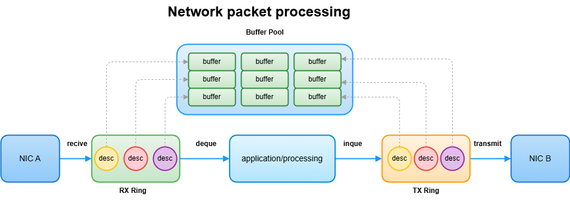
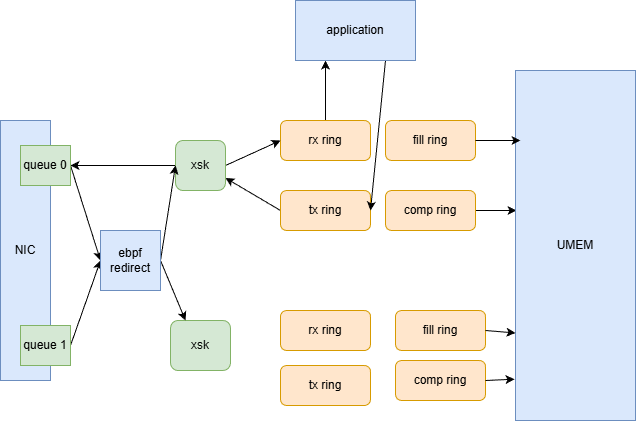

# 前言
之前看 [VPP AF_XDP device driver](https://s3-docs.fd.io/vpp/26.06/developer/devicedrivers/af_xdp.html) 的时候，看不懂。因为没有写过 AF_XDP socket。

最近不上班，学习下 AF_XDP socket 的基本使用。

阅读这几个链接，基本可掌握 AF_XDP socket 的基本使用：

1. [xdp-project/xdp-tutorial: XDP tutorial](https://github.com/xdp-project/xdp-tutorial)
2. [xdp-tools/lib/libxdp/README.org at main · xdp-project/xdp-tools](https://github.com/xdp-project/xdp-tools/blob/main/lib/libxdp/README.org)
3. [AF_XDP — The Linux Kernel documentation](https://docs.kernel.org/networking/af_xdp.html)

本文主要包含两个方面：

1. AF_XDP 的基本介绍。
2. 使用 AF_XDP 实现简单的 ICMP 应答。

# AF_XDP 的基本介绍

## 高性能网络收发包的一般结构

在介绍 AF_XDP 之前，我们先看下，高性能场景下，收发包的一般结构。

下面是的一般流程：
1. 必然是 ring + buffer mempool 结构。因为，如果要为每个包，从系统内存上分配内存，必然有性能问题。
2. 网卡将收到的数据包放在接收缓冲区(这里是RX Ring)
3. 应用程序，从接收缓冲区读取数据包
4. 应用程序，处理数据包。
5. 应用程序，将处理后的数据包写入发送缓冲区(这里是TX Ring)
6. 网卡将发送缓冲区的数据发送



不同场景下的收发包，可能有所不同（下面是我理解的。因为那些底层代码，我也没去真正看过）：
1. 每个工作线程，都有自己的 RX Ring 和 TX Ring，里面的存储结构是desc。
2. desc 中的指针指向 mempool 中的 buffer。 一个 desc 不可能同时出现在两个ring中。
3. RX Ring 从 mempool 中获取 buffer。TX Ring 要将 buffer 放回 mempool 中。 
4. mempool 可以采用 per-thread 设计。
5. mempool 也可以采用多生产者多消费者的设计，并且提供 per-thread Local Cache。RX ring alloc buffer 时，会从 Local Cache 中获取。TX ring 放回 buffer 时，会将 buffer 放回 Local Cache 中。

## AF_XDP 的数据包收发结构

AF_XDP 的数据包收发流程，要麻烦些。

先进行名词解释：
1. UMEME 是User Memory 的缩写。它是一块用户态分配的内存，用于存储数据包。（它是memepool）（这块内存，在用户态和内核态都可以访问。因为这块物理内存，在用户态和内核态有不同的虚拟地址。用户态和内核态通过不同的页表，将不同的虚拟地址，映射到相同的物理内存上。）
2. rx ring 是一个循环队列，用于存储，接收数据包的描述符。
3. tx ring 是一个循环队列，用于存储，要发送的数据包的描述符。
4. xsk 是 AF_XDP socket 的缩写，用于接收和发送数据包。每个 xsk 必须绑定到特定的网络设备和队列。每个 XSK 有独立的 RX/TX Rings。
5. eBPF Redirect 程序，挂载在网络入口位置。它可以通过 XSKMAP，将数据包重定向到指定的xsk中。



我上面没有介绍 fill ring 和 complete ring。因为，如果没有这两个，我们会看到，AF_XDP 的收发流程，和上一节介绍的基本流程，没有区别。

下面，我串下 af_xdp 的收发包流程：

1. 网卡有不同的队列。不同队列的包，在进入内核前，都会经过我们挂载的 ebpf redirect 程序。(这个程序会被多个CPU核心调用，所以要注意线程安全)
2. **每个 xsk 都唯一的绑定到特定设备的特定队列。每个 xsk 有独立的 RX/TX Rings**。
3. **一个 UMEM 可以有多组 fill ring 和 complete ring。但是每组ring，只能在单个 queue 上使用**。
4. 用户空间程序从UMEME中取buffer指针，放入 fill ring 的 desc 中。
5. 内核程序，从fill ring 中取出 desc，将数据包写入 desc 中指向的 buffer 中。
6. 内核程序，将数据包放入 desc 的bufer中，然后将 desc 放入 rx ring 中。
7. 应用程序从 rx ring中提取 desc，处理数据包。
8. 应用程序，处理完的数据包后，将desc写入 tx ring 中。
9. 内核程序，从 tx ring 中取出 desc，并发送对应的数据包。
10. 内核程序，将发送完成的 desc，放入 complete ring 中。
11. 用户空间程序从 complete ring 中提取 desc，将 buffer 放回 mempool 中。

# 使用 AF_XDP 实现 ICMP 应答

## 实验设计

1. 在流量的入口位置(xdp) 挂载一个 redirect ebpf 程序。将 ICMP 数据包，重定向用户空间。
2. 用户空间，解析这个 ICMP 请求数据包，并修改生成对应的 ICMP 应答数据包。
3. 用户程序，在将这个修改后的应答数据包，从源端口发送出去。

这个实验设计虽然简单。但是结构非常经典。将数据包以kernel bypass的方式，直接送到用户空间，用户空间处理后，再从网卡发出。

## 代码实现

详细的代码见：https://github.com/da1234cao/demo-2/tree/laboratory/44-af-xdp

这个代码挺不太好写。

### 内核空间的 ebpf 程序

将 ICMP 数据包，重定向到用户空间。(让AI写下，很容易实现)

```C
#if 1
#include <linux/bpf.h>
#include <linux/if_ether.h>
#include <linux/in.h>
#include <linux/ip.h>
#include <linux/types.h>
#include <linux/udp.h>
#else
#include "vmlinux.h"
#endif

#include <bpf/bpf_endian.h>
#include <bpf/bpf_helpers.h>
#include <xdp/xdp_helpers.h>

struct {
  __uint(type, BPF_MAP_TYPE_XSKMAP);
  __type(key, __u32);
  __type(value, __u32);
  __uint(max_entries, 64);
} xsks_map SEC(".maps");

SEC("xdp")
int xdp_sock_prog(struct xdp_md *ctx) {
  __u64 data_end = ctx->data_end;
  __u64 data = ctx->data;
  struct ethhdr *eth = (struct ethhdr *)data;
  struct iphdr *ip;
  __u16 h_proto;

  // Check Ethernet header
  if ((__u64)eth + sizeof(*eth) > data_end)
    return XDP_PASS;

  h_proto = eth->h_proto;
  // Only handle IPv4
  if (h_proto != bpf_htons(ETH_P_IP))
    return XDP_PASS;

  ip = (struct iphdr *)((__u64)eth + sizeof(*eth));
  if ((__u64)ip + sizeof(*ip) > data_end)
    return XDP_PASS;

  // Only handle ICMP protocol
  if (ip->protocol != IPPROTO_ICMP)
    return XDP_PASS;

  // Redirect to XSK if conditions are met
  int index = ctx->rx_queue_index;
  return bpf_redirect_map(&xsks_map, index, XDP_PASS);
}

char LICENSE[] SEC("license") = "GPL";
```


### 用户空间实现

这里串下实现过程：
1. 使用 argparse 解析命令函参数。
2. 获取网络设备的队列数量。
3. 创建一个类来挂载 ebpf 程序。在析构函数中，卸载 ebpf 程序。使用了 libxdp 库来挂载，从而自动应用 xdp_dispatcher。
4. 创建 umem 资源（即mempool资源）。
5. 每个队列创建和绑定一个 xsk。每个 xsk 有一组 rx ring,tx ring,fill ring,complete ring。它们从 local cache 中获取 buffer 指针。
6. 向 fill ring 中填充资源、从 rx ring 中提取数据包、处理数据包、将处理后的数据包写入 tx ring 中、将 complete ring 中的 资源放回local cache中。
7. 修改后的数据包，需要重新计算校验和。关于校验和的计算，可以参考：[Computing the Internet Checksum - da1234cao](https://www.da1234cao.space/computing-the-internet-checksum/)

```c
extern "C" {
#include <arpa/inet.h>
#include <bpf/bpf.h>
#include <linux/ethtool.h>
#include <linux/sockios.h>
#include <net/ethernet.h>
#include <net/if.h>
#include <netinet/ip_icmp.h>
#include <stdlib.h>
#include <sys/ioctl.h>
#include <sys/poll.h>
#include <sys/socket.h>
#include <unistd.h>
#include <xdp/libxdp.h>
#include <xdp/xsk.h>
}

#include <argparse/argparse.hpp>
#include <boost/scope_exit.hpp>
#include <cerrno>
#include <cstddef>
#include <cstdint>
#include <cstdlib>
#include <cstring>
#include <iostream>
#include <memory>
#include <signal.h>
#include <stdexcept>
#include <string>
#include <utility>

#define FRAME_SIZE XSK_UMEM__DEFAULT_FRAME_SIZE
#define RING_SIZE XSK_RING_CONS__DEFAULT_NUM_DESCS
#define PER_XSK_FRAME_NUM (4 * RING_SIZE)
#define BATCH_SIZE 64
#define INVALID_UMEM_FRAME UINT64_MAX

struct main_config {
  std::string interface;
  std::string filename;
};

struct xsk_umem_info {
  struct xsk_ring_prod fq;
  struct xsk_ring_cons cq;
  struct xsk_umem *umem;
  void *buffer;
};

struct xsk_socket_info {
  struct xsk_ring_cons rx;
  struct xsk_ring_prod tx;
  struct xsk_ring_prod fill;
  struct xsk_ring_cons comp;
  struct xsk_umem_info *umem;
  struct xsk_socket *xsk;

  uint64_t umem_frame_addr[PER_XSK_FRAME_NUM];
  uint32_t umem_frame_free;
};

static struct main_config main_config;
static volatile bool keep_running = true;

int interface_queue_count_query(const std::string &ifname) {
  // ethtool --show-channels <ifname>

  struct ethtool_channels ec = {};
  ec.cmd = ETHTOOL_GCHANNELS;

  struct ifreq ifr = {};
  ifr.ifr_data = (__caddr_t)&ec;
  snprintf(ifr.ifr_name, sizeof(ifr.ifr_name), "%s", ifname.c_str());

  const int fd = socket(AF_INET, SOCK_DGRAM, 0);
  if (fd < 0) {
    throw std::runtime_error("socket(AF_INET, SOCK_DGRAM) failed: " +
                             std::string(strerror(errno)));
  }
  BOOST_SCOPE_EXIT(&fd) { close(fd); }
  BOOST_SCOPE_EXIT_END

  const int ret = ioctl(fd, SIOCETHTOOL, &ifr);
  if (ret < 0) {
    throw std::runtime_error(
        "ioctl(SIOCETHTOOL, ETHTOOL_GCHANNELS) failed for " + ifname + ": " +
        std::string(strerror(errno)));
  }

  if (ec.combined_count > 0) {
    return ec.combined_count;
  }

  // Drivers may expose separate RX/TX queues without combined channels.
  // if (ec.rx_count > 0 || ec.tx_count > 0) {
  //   return std::max(ec.rx_count, ec.tx_count);
  // }

  throw std::runtime_error("failed to get queue count for interface: " +
                           ifname);
}

class xdp_attachment final {
public:
  xdp_attachment(const xdp_attachment &) = delete;
  xdp_attachment &operator=(const xdp_attachment &) = delete;

  ~xdp_attachment() { detach_noexcept(); }

  static xdp_attachment attach(const std::string &obj_path, int ifindex) {
    xdp_program *prog =
        xdp_program__open_file(obj_path.c_str(), "xdp", nullptr);
    if (!prog) {
      throw std::runtime_error("failed to open xdp program from: " + obj_path);
    }

    {
      struct xdp_multiprog *mp = xdp_multiprog__get_from_ifindex(ifindex);
      if (!mp) {
        throw std::runtime_error("failed to get xdp_multiprog for ifindex=" +
                                 std::to_string(ifindex));
      }
      struct xdp_program *tmp_prog = NULL;
      while ((tmp_prog = xdp_multiprog__next_prog(tmp_prog, mp))) {
        if (std::string(xdp_program__name(tmp_prog)) ==
            std::string(xdp_program__name(prog))) {
          enum xdp_attach_mode mode = xdp_multiprog__attach_mode(mp);
          int err = xdp_program__detach(tmp_prog, ifindex, mode, 0);
          if (err != 0) {
            throw std::runtime_error("failed to detach xdp program: " +
                                     std::string(strerror(errno)));
          }
        }
      }
    }

    // for (xdp_attach_mode mode : {XDP_MODE_NATIVE, XDP_MODE_SKB}) {
    for (xdp_attach_mode mode : {XDP_MODE_SKB}) {
      int rc = xdp_program__attach(prog, ifindex, mode, 0);
      if (rc == 0) {
        return xdp_attachment(prog, ifindex, mode);
      }
    }

    xdp_program__close(prog);
    throw std::runtime_error(
        "failed to attach XDP program to ifindex=" + std::to_string(ifindex) +
        ": " + std::string(strerror(errno)));
  }

  int xdp_map_fd_get(const char *map_name) const {
    struct bpf_map *map =
        bpf_object__find_map_by_name(xdp_program__bpf_obj(prog_), map_name);
    return bpf_map__fd(map);
  }

private:
  xdp_attachment(xdp_program *prog, int ifindex, xdp_attach_mode mode)
      : prog_(prog), ifindex_(ifindex), mode_(mode) {}

  void detach_noexcept() noexcept {
    if (!prog_ || ifindex_ == 0)
      return;
    (void)xdp_program__detach(prog_, ifindex_, mode_, 0);
    xdp_program__close(prog_);
    prog_ = nullptr;
    ifindex_ = 0;
  }

  xdp_program *prog_{nullptr};
  int ifindex_{0};
  xdp_attach_mode mode_{XDP_MODE_NATIVE};
};

static struct xsk_umem_info *configure_xsk_umem(int queue_count) {
  uint64_t num_frames = queue_count * PER_XSK_FRAME_NUM;
  DECLARE_LIBXDP_OPTS(xsk_umem_opts, opts, .size = num_frames * FRAME_SIZE,
                      .fill_size = RING_SIZE, .comp_size = RING_SIZE,
                      .frame_size = FRAME_SIZE,
                      .frame_headroom = XDP_PACKET_HEADROOM, );

  void *buffer = aligned_alloc(getpagesize(), opts.size);
  if (buffer == nullptr) {
    throw std::runtime_error("failed to alloc xsk umem: " +
                             std::string(strerror(errno)));
  }

  struct xsk_umem_info *umem = (struct xsk_umem_info *)calloc(1, sizeof(*umem));
  if (umem == nullptr) {
    throw std::runtime_error("failed to alloc xsk_umem_info: " +
                             std::string(strerror(errno)));
  }

  umem->buffer = buffer;

  umem->umem = xsk_umem__create_opts(buffer, &umem->fq, &umem->cq, &opts);
  if (umem->umem == nullptr) {
    throw std::runtime_error("failed to create umem: " +
                             std::string(strerror(errno)));
  }
  return umem;
}

static uint64_t xsk_alloc_umem_frame(struct xsk_socket_info *xsk) {
  uint64_t frame;
  if (xsk->umem_frame_free == 0) {
    throw std::runtime_error("umem frame free is 0");
  }

  frame = xsk->umem_frame_addr[--xsk->umem_frame_free];
  xsk->umem_frame_addr[xsk->umem_frame_free] = INVALID_UMEM_FRAME;
  return frame;
}

static void xsk_free_umem_frame(struct xsk_socket_info *xsk, uint64_t frame) {
  assert(xsk->umem_frame_free < PER_XSK_FRAME_NUM);
  xsk->umem_frame_addr[xsk->umem_frame_free++] = frame;
}

static uint64_t xsk_umem_free_frames(struct xsk_socket_info *xsk) {
  return xsk->umem_frame_free;
}

static struct xsk_socket_info *
configure_xsk_socket(const char *ifname, unsigned int queue_id,
                     struct xsk_umem_info *umem, xdp_attachment &attachment) {
  struct xsk_socket_info *xsk =
      (struct xsk_socket_info *)calloc(1, sizeof(*xsk));
  if (xsk == nullptr) {
    throw std::runtime_error("failed to alloc xsk_socket_info: " +
                             std::string(strerror(errno)));
  }

  DECLARE_LIBXDP_OPTS(xsk_socket_opts, socket_opts, .rx = &xsk->rx,
                      .tx = &xsk->tx, .fill = &xsk->fill, .comp = &xsk->comp,
                      .rx_size = RING_SIZE, .tx_size = RING_SIZE,
                      .libxdp_flags = XSK_LIBXDP_FLAGS__INHIBIT_PROG_LOAD, );

  xsk->umem = umem;
  xsk->xsk =
      xsk_socket__create_opts(ifname, queue_id, umem->umem, &socket_opts);
  if (xsk->xsk == nullptr) {
    throw std::runtime_error("failed to create xsk_socket: " +
                             std::string(strerror(errno)));
  }

  int ret = xsk_socket__update_xskmap(xsk->xsk,
                                      attachment.xdp_map_fd_get("xsks_map"));
  if (ret) {
    throw std::runtime_error("failed to update xsk map: " +
                             std::string(strerror(errno)));
  }

  /* Initialize umem frame allocation */
  const uint32_t per_xsk_num_descs = PER_XSK_FRAME_NUM;
  const uint32_t frame_size = FRAME_SIZE;
  const uint32_t start_frame = queue_id * per_xsk_num_descs;

  for (int i = 0; i < per_xsk_num_descs; i++) {
    xsk->umem_frame_addr[i] = (start_frame + i) * frame_size;
  }
  xsk->umem_frame_free = per_xsk_num_descs;

  // Stuff the receive path with buffers, so that we can receive packets.
  uint32_t idx = 0;
  uint64_t addr;
  int ring_size = RING_SIZE;
  ret = xsk_ring_prod__reserve(&xsk->fill, ring_size, &idx);
  while (ret != ring_size) {
    ret = xsk_ring_prod__reserve(&xsk->fill, ring_size, &idx);
  }

  for (uint32_t i = 0; i < ring_size; i++) {
    *xsk_ring_prod__fill_addr(&xsk->fill, idx++) = xsk_alloc_umem_frame(xsk);
  }

  xsk_ring_prod__submit(&xsk->fill, ring_size);

  return xsk;
}

static void hex_dump(void *pkt, size_t length, uint64_t addr) {
  const unsigned char *address = (unsigned char *)pkt;
  const unsigned char *line = address;
  size_t line_size = 32;
  unsigned char c;
  char buf[32];
  int i = 0;

  sprintf(buf, "addr=%llu", addr);
  printf("length = %zu\n", length);
  printf("%s | ", buf);
  while (length-- > 0) {
    printf("%02X ", *address++);
    if (!(++i % line_size) || (length == 0 && i % line_size)) {
      if (length == 0) {
        while (i++ % line_size)
          printf("__ ");
      }
      printf(" | "); /* right close */
      while (line < address) {
        c = *line++;
        printf("%c", (c < 33 || c == 255) ? 0x2E : c);
      }
      printf("\n");
      if (length > 0)
        printf("%s | ", buf);
    }
  }
  printf("\n");
}

static uint16_t checksum(const uint16_t *buf, size_t len) {
  uint32_t sum = 0;
  while (len > 1) {
    sum += *buf++;
    len -= 2;
  }
  if (len == 1) {
    sum += *(uint8_t *)buf;
  }
  sum = (sum >> 16) + (sum & 0xFFFF);
  sum += (sum >> 16);
  return static_cast<uint16_t>(~sum);
}

static void complete_tx(struct xsk_socket_info *xsk) {

  sendto(xsk_socket__fd(xsk->xsk), NULL, 0, MSG_DONTWAIT, NULL, 0);

  /* Collect/free completed TX buffers */
  uint32_t idx_cq;
  uint32_t completed = xsk_ring_cons__peek(&xsk->comp, BATCH_SIZE, &idx_cq);

  if (completed > 0) {
    for (int i = 0; i < completed; i++) {
      uint64_t addr = *xsk_ring_cons__comp_addr(&xsk->comp, idx_cq++);
      xsk_free_umem_frame(xsk, addr);
    }

    xsk_ring_cons__release(&xsk->comp, completed);
  }
}

static void process_packet(struct xsk_socket_info *xsk, uint64_t addr,
                           uint32_t len) {
  void *pkt = xsk_umem__get_data(xsk->umem->buffer, addr);

  struct ethhdr *eth = (struct ethhdr *)pkt;
  if (ntohs(eth->h_proto) != ETH_P_IP) {
    return;
  }

  struct iphdr *ip = (struct iphdr *)(eth + 1);
  if (ip->protocol != IPPROTO_ICMP) {
    return;
  }

  struct icmphdr *icmp = (struct icmphdr *)((uint8_t *)ip + ip->ihl * 4);
  if (icmp->type != ICMP_ECHO) {
    return;
  }

  unsigned char mac_tmp[6];
  memcpy(mac_tmp, eth->h_dest, 6);
  memcpy(eth->h_dest, eth->h_source, 6);
  memcpy(eth->h_source, mac_tmp, 6);
#if 1
  uint32_t ip_tmp = ip->saddr;
  ip->saddr = ip->daddr;
  ip->daddr = ip_tmp;

  // Recalculate IP header checksum
  ip->check = 0;
  ip->check = checksum(reinterpret_cast<uint16_t *>(ip), ip->ihl * 4);

  icmp->type = ICMP_ECHOREPLY;
  icmp->checksum = 0;
  uint16_t ip_total_len = ntohs(ip->tot_len);
  uint16_t icmp_len = ip_total_len - ip->ihl * 4;
  icmp->checksum = checksum(reinterpret_cast<uint16_t *>(icmp), icmp_len);
#endif
  uint32_t tx_idx = 0;
  int reserve_ret = xsk_ring_prod__reserve(&xsk->tx, 1, &tx_idx);
  if (reserve_ret != 1) {
    /* No more transmit slots, drop the packet */
    return;
  }

  struct xdp_desc *desc = xsk_ring_prod__tx_desc(&xsk->tx, tx_idx);
  desc->addr = addr;
  desc->len = len;
  xsk_ring_prod__submit(&xsk->tx, 1);

  complete_tx(xsk);
}

static void handle_receive_packets(struct xsk_socket_info *xsk) {
  uint32_t idx_rx = 0;
  uint32_t rcvd = xsk_ring_cons__peek(&xsk->rx, BATCH_SIZE, &idx_rx);
  if (rcvd == 0)
    return;

  /* Stuff the ring with as much frames as possible */
  int stock_frames = xsk_prod_nb_free(&xsk->fill, xsk_umem_free_frames(xsk));
  if (stock_frames > 0) {
    uint32_t idx_fq = 0;
    int ret = xsk_ring_prod__reserve(&xsk->fill, stock_frames, &idx_fq);

    while (ret != stock_frames)
      ret = xsk_ring_prod__reserve(&xsk->fill, rcvd, &idx_fq);

    for (int i = 0; i < stock_frames; i++)
      *xsk_ring_prod__fill_addr(&xsk->fill, idx_fq++) =
          xsk_alloc_umem_frame(xsk);

    xsk_ring_prod__submit(&xsk->fill, stock_frames);
  }

  for (uint32_t i = 0; i < rcvd; i++) {
    const struct xdp_desc *desc = xsk_ring_cons__rx_desc(&xsk->rx, idx_rx++);
    uint64_t addr = desc->addr;
    uint32_t len = desc->len;

    void *pkt = xsk_umem__get_data(xsk->umem->buffer, addr);

    process_packet(xsk, addr, len);
    hex_dump(pkt, len, addr);

    xsk_free_umem_frame(xsk, addr);
  }

  xsk_ring_cons__release(&xsk->rx, rcvd);
}

static void signal_handler(int signum) {
  std::cerr << "Received signal: " << signum << std::endl;
  keep_running = false;
}

void rx_and_process(std::vector<struct xsk_socket_info *> &xsk_vec) {
  int nfds = xsk_vec.size();
  struct pollfd fds[nfds];

  for (int i = 0; i < nfds; i++) {
    fds[i].fd = xsk_socket__fd(xsk_vec[i]->xsk);
    fds[i].events = POLLIN;
  }

  while (keep_running) {
    int ret = poll(fds, nfds, 1000);
    if (ret <= 0) {
      continue;
    }

    for (int i = 0; i < nfds; i++) {
      if (fds[i].revents & POLLIN) {
        handle_receive_packets(xsk_vec[i]);
      }
    }
  }

  // Clean up resources
  for (auto xsk : xsk_vec) {
    xsk_socket__delete(xsk->xsk);
    free(xsk);
  }
  xsk_vec.clear();
}

int main(int argc, char *argv[]) {
  argparse::ArgumentParser argparse("af-xdp");

  argparse.add_argument("-i", "--interface")
      .required()
      .store_into(main_config.interface)
      .help("The network interface to attach the XDP program");

  argparse.add_argument("--filename")
      .required()
      .store_into(main_config.filename)
      .help("The filename of the XDP program");

  try {
    argparse.parse_args(argc, argv);

    // get queue count
    int queue_count = interface_queue_count_query(main_config.interface);
    std::cout << "interface "
              << main_config.interface << " queue count: " << queue_count
              << std::endl;

    const unsigned int ifindex = if_nametoindex(main_config.interface.c_str());
    if (ifindex == 0) {
      throw std::runtime_error("if_nametoindex failed for " +
                               main_config.interface + ": " +
                               std::string(strerror(errno)));
    }

    // attach xdp prog
    auto attachment =
        xdp_attachment::attach(main_config.filename, static_cast<int>(ifindex));

    // create umem
    struct xsk_umem_info *umem = configure_xsk_umem(queue_count);

    // Set up signal handlers
    signal(SIGINT, signal_handler);
    signal(SIGTERM, signal_handler);
    signal(SIGABRT, signal_handler);

    // create xsk for intf per-queue
    std::vector<struct xsk_socket_info *> xsk_vec;
    for (unsigned int i = 0; i < queue_count; i++) {
      struct xsk_socket_info *xsk = configure_xsk_socket(
          main_config.interface.c_str(), i, umem, attachment);
      xsk_vec.push_back(xsk);
    }

    rx_and_process(xsk_vec);

    // Clean up UMEM
    xsk_umem__delete(umem->umem);
    free(umem->buffer);
    free(umem);

  } catch (const std::exception &err) {
    std::cerr << err.what() << std::endl;
    return EXIT_FAILURE;
  }
}
```

### 实验测试

禁止当前机器进行ICMP应答。

```
5: ens224: <BROADCAST,MULTICAST,UP,LOWER_UP> mtu 1500 qdisc mq state UP group default qlen 1000
    link/ether 00:0c:29:b9:06:8d brd ff:ff:ff:ff:ff:ff
    altname enp19s0
    inet 10.0.0.2/24 scope global ens224
       valid_lft forever preferred_lft forever

root@rocky-02 ~# sysctl -w net.ipv4.icmp_echo_ignore_all=1
net.ipv4.icmp_echo_ignore_all = 1
root@rocky-02 ~# sysctl -a | grep icmp_echo_ignore_all
net.ipv4.icmp_echo_ignore_all = 1
```

从另一台机器，ping当前机器，ping失败。

```shell
root@localhost ~# ping 10.0.0.2
PING 10.0.0.2 (10.0.0.2) 56(84) bytes of data.
^C
--- 10.0.0.2 ping statistics ---
1 packets transmitted, 0 received, 100% packet loss, time 0ms
```

启动当前程序。

```shell
./af-xdp --filename af_xdp_kern.bpf.o -i ens224
```

重新从另一台机器，ping当前机器，ping成功。

```shell
root@localhost ~ [1]# ping 10.0.0.2
PING 10.0.0.2 (10.0.0.2) 56(84) bytes of data.
64 bytes from 10.0.0.2: icmp_seq=1 ttl=64 time=1.14 ms
64 bytes from 10.0.0.2: icmp_seq=2 ttl=64 time=1.74 ms
```

# 其他

## 共享内存池和队列的组合关系

写上面代码的时候，遇到过一个问题：UMEM, rx ring, tx ring, fill ring, comp ring, xsk, device queue, 它们的数量关系是怎样的。

核心考虑的话，抓住这几点就不会有问题了:
- 这些 ring 都是单生产者单消费者，使用时要注意线程安全；
- 正常设计的情况下，出于性能考虑，我们都会为每个 device queue 分配 一对 rx ring 和 tx ring。

下面这些关系也是合法的，在一些示例中，我们也会看到：

1) 一个<device, queue>, 绑定了多个 xsk。ebpf redirect 的时候，不会自动负载均衡，需要程序选择传递给哪个 xsk。这些 xsk 可以共享同一个 UMEME，也只有一对 fill ring 和 comp ring。 

```shell
2 个 XSK（都绑定到 eth0/queue-0，共享同一个 UMEM）
├── UMEM: 1 个 FILL ring + 1 个 COMPLETION ring（共享！）
├── XSK#1: 1 个 RX ring + 1 个 TX ring（独立）
└── XSK#2: 1 个 RX ring + 1 个 TX ring（独立）
✅ 总共：2 RX + 2 TX + 1 FILL + 1 COMPLETION = 6 rings
```

2) 每个<device, queue>, 绑定了一个 xsk。这些 xsk 可以共享同一个 UMEME。（本文的示例代码就是这样的结构）

```shell
2 个 XSK：eth0/queue-0 和 eth0/queue-1，共享同一个 UMEM
├── UMEM for queue-0: 1 FILL + 1 COMPLETION
├── UMEM for queue-1: 1 FILL + 1 COMPLETION
├── XSK#1: RX + TX
└── XSK#2: RX + TX
✅ 总共：2 RX + 2 TX + 2 FILL + 2 COMPLETION = 8 rings
```

3) 每个<device, queue>, 绑定了一个 xsk。这些 xsk 都使用独立的 UMEME

```shell
✅ 每个 XSK 独立：2 × (1 RX + 1 TX + 1 FILL + 1 COMPLETION) = 8 rings
```

回头看，这是很常见的做法。类似于，dpdk 可以使用 一个 core 可以从多个队列收包。但是，dpdk不能使用多个 core 从同一个队列收包。

## more

1. 在回收 addr 的时候，我们会发现 addr 的偏移量，不是 frame size 的整数倍。addr == headroom_size + 256。即，总是多出来256。这是正常现象，虽然我不知道它的背后具体是什么情况：[Unexpected addr offset on handle\_receive\_packets · Issue #448 · xdp-project/xdp-tutorial](https://github.com/xdp-project/xdp-tutorial/issues/448)
2. 本文的 ebpf 挂载在 XDP_MODE_SKB 位置，而不是 XDP_MODE_NATIVE。如果挂载在NATIVE位置，收到包的长度总是 1522， 而不是包的真实长度，且发包的时候发不出去。我知道是虚拟网卡驱动(vmxnet3)的问题，还是我哪里的设置有问题。（我找别的程序也试了下，它们 desc 中的 len，也不是包的真实长度）
3. 我个人感觉 af xdp 这套接口设计的并不好，或者说 libxdp 的这套封装并不好。当然，只是菜鸟之见，也许是不得不这么做。好的设计，应该参考 dpdk mempool + ring 的方法。将 mempool 的指针存储在ring中。当ring需要分配内存时，自动从 mempool 中获取。屏蔽用户的感知。屏蔽用户手动管理local cache。
4. 因为我没有去看 ICMP RFC 文档，没有阅读内核和其他的ICMP应答示例，所以本文只是一个简单的ICMP应答。
5. 本文使用了cmake来构建项目。用它来构建 ebpf 程序，拉取和构建libxdp源码。（因为rocky9 上，包管理器中没有 libxdp debuginfo 的包，遇到问题的时候，没法调试libxdp）。在构建C/C++ 项目的时候，我们应该摒弃Makefile。
6. cmake 构建 ebpf 的时，没法将其构建过程，写入到 compile_commands 中。因为是调用外部clang命令进行构建的。初非我们使用 bear。但是 bear 在增量构建时，原有的内容会被覆盖。关于 clangd 的相关介绍，可以参考：[clangd 的简单使用 - da1234cao](https://www.da1234cao.space/simple-use-of-clangd/)